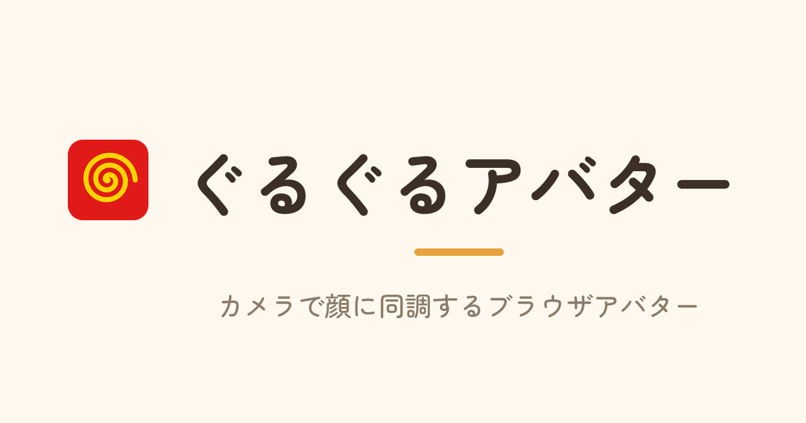

<div align="center">

# ぐるぐるアバター 🌀

Webカメラで顔の向き・口の動きに同調する、配信向けブラウザアバター

[](LICENSE)
[](https://vite.dev/)
[](https://react.dev/)
[](https://ai.google.dev/edge/mediapipe)
[](https://github.com/tommie-jp/guruguru-avatar/actions/workflows/pages.yml)

[](https://tommie-jp.github.io/guruguru-avatar/camera.html)

## [🎥 ライブデモを開く（要Webカメラ）](https://tommie-jp.github.io/guruguru-avatar/camera.html)

</div>

---

## ✨ 特徴

- 🎥 **カメラ顔追従** — MediaPipe FaceLandmarker で顔の向きを推定し、**25方向**のフレームに同調
- 👄 **口パク** — 口の開きに合わせて 3 段階（とじ / はんびらき / ぜんかい）で切り替え
- 😉 **まばたき** — 目を閉じたタイミングや自動まばたきに連動
- 📺 **OBS 透過オーバーレイ** — `?obs=1` で背景透過・UI 非表示。配信にそのまま重ねられる
- 🗣 **複数モード同梱** — マイク音量で動くトーク版、マウス追従のぐるぐる版、手・ポーズ可視化のトラッキング版

> フォーク元の [rotejin/tomari-guruguru](https://github.com/rotejin/tomari-guruguru)（マウス追従＋口パク）を、
> Webカメラで顔に同調するように拡張したものです。

---

## 🚀 クイックスタート

必要環境: **Node.js 22 LTS 推奨**（Vite 8 の要件は Node.js 20.19+ または 22.12+）。

```bash
git clone https://github.com/tommie-jp/guruguru-avatar.git
cd guruguru-avatar
npm install
npm run dev
```

- `npm run dev` で `camera.html` が自動で開きます（MediaPipe アセットのコピーも自動実行）。
- カメラは secure context が必要です。`http://localhost:5173/camera.html` または `127.0.0.1` で開いてください。
- WSL は自動判定で `0.0.0.0` にバインドします。Windows 側の Chrome からは起動ログの `Network:` の URL で開けます。
- `.env.local` は通常不要です（ヘッドレスやリモート閲覧で明示上書きしたいときだけ `.env.local.example` を利用）。

---

## 🕹 モードとエントリ

| モード | エントリ | 内容 |
| --- | --- | --- |
| **カメラ版**（主役） | `camera.html` | Webカメラで顔の向き・口に同調。配信向け |
| トーク版 | `talk.html` | マイク入力／音声ファイルに合わせて口パク |
| ぐるぐる版 | `guruguru.html` | マウス追従で25方向に振り向く |
| トラッキング | `tracking.html` | 手・体のポーズを推定して可視化するデモ |
| トップ（カメラ版2・Pixi） | `index.html` | スプライト描画・複数アバター選択。サイトのトップ（旧 `camera2.html`） |
| 旧トップ | `index_old.html` | `camera.html` へ自動転送（旧 `index.html`） |
| 互換リダイレクト | `camera2.html` | `index.html` へ自動転送（OGPキャッシュ・旧共有リンク対策） |

---

## 📺 OBS・配信で使う

カメラ版はそのまま OBS のブラウザソースに重ねられます。

- `camera.html?obs=1` … **ステージモード**（背景透過＋UI 非表示。アバターだけを表示）
- `?shadow=N` … 影の強さを指定（任意）
- ステージモード中は **`T` キー**で Tweaks パネルを開閉
- 手順の詳細は [docs-camera/04-OBSでライブ配信.md](docs-camera/04-OBSでライブ配信.md)

OBS で使う場合は、Tweaks の背景色をクロマキーしやすい色に調整するのも有効です。

---

## ⚙️ 仕組み（フレーム画像）

向きと表情に応じて `public/slices2/<状態>/r<行>c<列>.webp` を1枚ずつ切り替えています。

<details>
<summary><b>25方向 × 6状態のマッピングを見る</b></summary>

### 25方向（5列 × 5行）

- 列 `c0`〜`c4`: 左向き → 左斜め → **正面** → 右斜め → 右向き
- 行 `r0`〜`r4`: 強く上 → 少し上 → **水平** → 少し下 → 強く下

### 6状態（目 × 口）

| フォルダ | 目 | 口 |
| --- | --- | --- |
| `A` | 開け | とじ |
| `B` | 開け | 中間 |
| `C` | 開け | 開け |
| `D` | 閉じ | とじ |
| `E` | 閉じ | 中間 |
| `F` | 閉じ | 開け |

画像パス例: `slices2/A/r2c2.webp`（正面・目開け・口とじ）。
参照先は [src/character-config.js](src/character-config.js) の `basePath` / `ext` で切り替えできます。

</details>

---

## 🎨 自分のキャラで作る

<details>
<summary><b>5×5角度シート 6枚から差し替える手順</b></summary>

最終的に **5×5角度シートを6枚**（`A`〜`F` = 目の開閉 × 口の開き）用意します。

```text
A_目開け_口とじ.png
B_目開け_口中間.png
C_目開け_口開け.png
D_目閉じ_口とじ.png
E_目閉じ_口中間.png
F_目閉じ_口開け.png
```

おすすめの流れ:

1. 自分のキャラクター参照画像を用意する
2. `docs/01_画像生成用テンプレ.png` と合わせて画像生成 AI に添付する
3. `docs/01_画像生成用プロンプト.txt` の指示で6枚のシートを作る
4. 6枚の PNG を `新キャラ資料/` フォルダに入れる
5. `tools/slice_character_sheets.py` でスライス画像を生成する

詳しい注意点や検証方法は [docs/新キャラ差し替え手順.md](docs/新キャラ差し替え手順.md) を参照してください。

</details>

---

## 🛠 開発

```bash
npm run dev       # 開発サーバー（127.0.0.1:5173、camera.html が自動で開く）
npm test          # Vitest（ユニットテスト）
npm run build     # 本番ビルド（dist/ 出力）
npm run preview   # ビルド結果を確認（/guruguru-avatar/ ベースで起動）
```

`preview` は GitHub Pages と同じ `/guruguru-avatar/` のベースパスで動きます。

```text
http://127.0.0.1:4173/guruguru-avatar/camera.html
```

---

## 🧩 技術スタック

- **Vite 8** — ビルド・開発サーバー（マルチエントリ）
- **React 18** — UI
- **@mediapipe/tasks-vision** — 顔・手・ポーズの推論（FaceLandmarker ほか）
- **Vitest** — ユニットテスト

---

## 📁 構成

```text
.
├── camera.html             # カメラ版エントリ（主役）
├── talk.html               # トーク版エントリ
├── guruguru.html           # ぐるぐる版エントリ
├── tracking.html           # トラッキング版エントリ
├── index.html              # トップ（カメラ版2・Pixi／複数アバター。旧 camera2.html）
├── index_old.html          # camera.html へのリダイレクト（旧 index.html）
├── camera2.html            # index.html へのリダイレクト（OGPキャッシュ/旧リンク対策）
├── vite.config.js          # 本家と字面一致を保つ素の設定
├── vite.fork.js            # フォーク固有の設定（エントリ／WSL／base）
├── src/
│   ├── camera-app.jsx      # カメラ版本体
│   ├── talk-app.jsx        # トーク版本体
│   ├── app.jsx             # ぐるぐる版本体
│   ├── tracking-app.jsx    # トラッキング版本体
│   ├── face/               # 顔ランドマーク推論
│   ├── tracking/           # 手・ポーズ推論
│   ├── obs-mode.js         # ?obs=1 などの URL パラメータ解釈
│   ├── tweaks-panel.jsx    # 画面右下の調整パネル
│   ├── use-tweaks.js       # Tweaks の状態管理
│   └── character-config.js # キャラ画像の参照先を一元管理
├── scripts/                # MediaPipe アセット配置／Pages 検証
├── public/
│   ├── slices2/            # スライス済みキャラ画像（Git 追跡）
│   ├── mediapipe/          # MediaPipe モデル（npm script で配置）
│   └── ogp.png             # OGP / ヒーロー画像
├── docs/                   # 画像生成・キャラ差し替え資料
├── docs-camera/            # カメラ版・OBS 配信などの手順
├── tools/slice_character_sheets.py
├── LICENSE                 # プログラム（MIT）
├── ASSET_LICENSE.md        # 画像・音声（非商用）
└── README.md
```

---

## 🚢 デプロイ

GitHub Pages で公開しています（base = `/guruguru-avatar/`）。push では自動デプロイされないため、
`workflow_dispatch` を手動トリガーします。リポジトリ直下の `doDeploy.sh` が起動から完了監視・反映確認までを行います。

```bash
git push origin main
./doDeploy.sh
```

公開URL: [https://tommie-jp.github.io/guruguru-avatar/](https://tommie-jp.github.io/guruguru-avatar/)
（トップは `camera.html` へ自動転送）

---

## 📜 ライセンス

**プログラム** と **キャラクター素材・音声** でライセンスを分けています。

- **プログラム部分**: [MIT License](LICENSE)
- **キャラクター画像・キャラクターシート・スライス済みフレーム・音声・生成素材**:
  これらは **フォーク元 [rotejin](https://github.com/rotejin/tomari-guruguru) 氏（原作者）の著作物**であり、
  MIT License の **対象外**です。権利はすべて rotejin 氏に帰属します。本フォークは許諾の範囲で同梱しているだけで、
  これらの素材に対する著作権を主張しません。
  非商用の範囲での SNS 投稿などは可能ですが、商用利用・他プロジェクトへの流用・再配布・改変・AI 学習などは禁止です。
  詳細な条件は [ASSET_LICENSE.md](ASSET_LICENSE.md) を参照してください。

---

## 🙏 クレジット

フォーク元: [rotejin/tomari-guruguru](https://github.com/rotejin/tomari-guruguru)（トマリぐるぐる／トマリトーク）。
向きと表情のフレーム切り替えという発想と、トーク／ぐるぐる版のベースはフォーク元によるものです。
