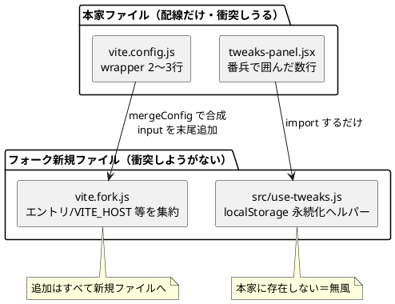

# マージしやすい構成

本家（upstream）が変更してもマージが楽になるように、フォーク固有のコードを
本家ファイルから切り離すための方針メモ。実際に施した変更もここに記録する。

関連: [02-フォーク元の取り込み.md](02-フォーク元の取り込み.md)

## 大原則

> 追加はすべて新規ファイルへ。本家ファイルは「配線」だけにする。

コンフリクトしうるのは **本家が所有していて自分も変更したファイルだけ**。
新規追加ファイルは本家が同名を作らない限り永久に無風。したがって狙いは2つ:

1. 本家ファイルを編集する **数を減らす**
2. 残る編集の **1ファイルあたりの差分を小さく** して 3-way マージを通りやすくする



## 施した変更

### 1. Vite 設定をフォーク分離（`vite.fork.js`）

本家 `vite.config.js` の中身は **upstream とほぼ同じ形に保つ**。フォーク固有の追加
（カメラ/トラッキングのエントリ、WSL 向けの `VITE_HOST` / `VITE_NO_OPEN`）は
`vite.fork.js` に集約し、`mergeConfig` で合成する。

- `vite.config.js` の `upstreamConfig` は本家の設定オブジェクトと**同じ字面**なので、
  本家がここを直しても 3-way マージがそのまま当たる。
- **新ページを足すときは `vite.fork.js` の `input` に1行足すだけ**。`vite.config.js` は
  二度と触らなくてよい。
- `mergeConfig` は `build.rollupOptions.input` を**オブジェクトとして併合**するので、
  本家が4ページ目を足しても自動で取り込まれる。

```js
// vite.config.js（抜粋）
export default defineConfig((env) =>
  mergeConfig(upstreamConfig(env), forkConfig(env)),
);
```

### 2. Tweaks の永続化ヘルパーを分離（`src/use-tweaks.js`）

`src/tweaks-panel.jsx` は vendored scaffold（本家が丸ごと差し替える想定）。
ここへのフォーク追加 +96 行のうち、**純粋な追加**である localStorage 永続化ヘルパー
（`tweaksStorageKey` / `loadTweaks` / `saveTweaks`）を `src/use-tweaks.js` に移し、
import するだけにした。

- ヘルパーは本家に存在しない＝**衝突しようがない**ファイルへ退避。
- `tweaks-panel.jsx` に残るフォーク差分（`useTweaks` の永続化呼び出し・3要素返し、
  外側クリックで閉じる effect）は本家コードと不可分なので**番兵コメント**で囲んだ:

```text
// ── fork:persist ↓ ──  …フォーク追加…  // ── fork:persist ↑ ──
```

衝突時に「どこが自分の変更か」が一目で分かり、本家の新 scaffold への再適用が容易。

## まだ残る本家ファイルの編集（許容範囲）

| ファイル | 残差分 | 理由 |
| --- | --- | --- |
| `vite.config.js` | wrapper 2〜3行 | Vite が読む入口。配線は不可避だが固定で安定 |
| `tweaks-panel.jsx` | 番兵で囲んだ数行 | scaffold 内の挙動変更（永続化・外側クリック）は抽出不能 |
| `package.json` | deps/scripts 追加 | `@mediapipe` 依存等。末尾追加で衝突を避ける |
| `.gitignore` / `app.jsx` / `talk-app.jsx` | 各数行 | 小さく、衝突しても自明 |

## 運用のコツ

- **`git config rerere.enabled true`** — 一度解決したコンフリクトを次回自動再適用。
- 本家は **こまめに小さく取り込む**。乖離が大きいほど衝突も大きい。
- 本家ファイルを編集するときは **既存行を並べ替え・再整形しない**。3-way マージは
  周囲が一致していれば通る。追加はオブジェクト/配列の**末尾**に置く。
