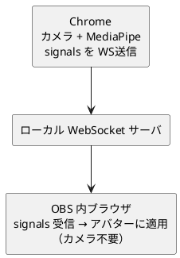
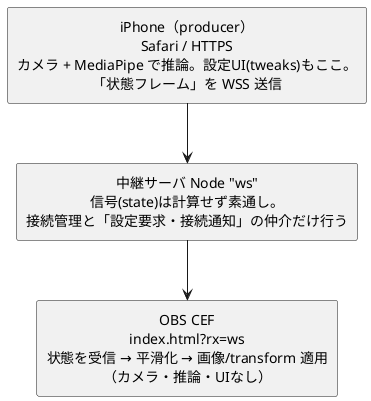

# OBS にカメラを触らせない代替案（別ブラウザ + WebSocket 中継）

OBS 内蔵ブラウザ(CEF)にカメラを使わせる代わりに、**顔トラッキングを通常の Chrome で動かし、
推定した向き(signals)を OBS 側のページへ送る**構成の構想メモ。これが実現すると
`--enable-media-stream`（[04-OBSでライブ配信.md](04-OBSでライブ配信.md)）が不要になる。

ステータス: **WS 中継方式（下記「iPhone 起点の構成」）は実装済み**（`?tx`/`?rx` ＋ `npm run relay`、
ユニット/結線テスト済み・実機での通し確認は未）。従来の `--enable-media-stream` 方式も引き続き利用可。

## 動機

- OBS の CEF はカメラ周りの制約が多い（既定でブロック、フラグ必須、API も限定的）。
- 通常の Chrome ならカメラ・MediaPipe が速く確実に動く。
- トラッキングを Chrome に出し、OBS 側は描画だけにすれば CEF の制約を回避できる。

## 重要: 通信できる/できないの境界

ページ間通信の機構は「同じブラウザの中」しか繋がらないものが多い。

- 同じ Chrome の2タブ（同一オリジン）
  → BroadcastChannel / localStorage の storage イベント / SharedWorker が**サーバ不要**で使える。
- **別ブラウザ間（Chrome ↔ OBS の CEF）** ← 今回はこれ
  → 上記は**全て使えない**（storage も BroadcastChannel もプロセスを跨がない）。
  → オリジンが同じ（どちらも `localhost:5173`）でもブラウザごとに隔離される。
  → **ネットワーク経由の中継が必須**。

## 定番構成: ローカル WebSocket 中継



- 送信側（Chrome）: 既存のトラッキングをそのまま使い、`deriveFaceSignals` が作る小さな
  signals（yaw/pitch/roll/mouth/eyes/pos/scale 等）を WS で投げる。
- 受信側（OBS ページ）: 新モード（例 `index.html?recv=ws`）で WS を購読し、受け取った
  signals を**既存の ref 群へそのまま流し込む**（カメラ・推論を起動しない）。
- WS サーバは Node の `ws` で十数行。Vite の dev サーバにミドルウェアとして同居も可能。

このプロジェクトは元々 `deriveFaceSignals`（信号）と描画を分離しているので、
signals をそのまま WS のペイロードにできる＝相性が良い。

## 他の選択肢

- WebRTC DataChannel: P2P で低遅延だが、結局シグナリング用サーバが要り複雑。localhost では過剰。
- SSE / HTTP ポーリング: Chrome が POST → OBS が EventSource で受信。Vite ミドルウェアだけで
  作れるが、高頻度ストリーミングは WS の方が素直。
- localhost なら **WebSocket が最良**（双方向・低遅延・実装が軽い）。

## トレードオフ（vs `--enable-media-stream`）

- 利点: OBS にカメラを触らせない／Chrome の精度・速度で回せる／別PCの Chrome から送ることも可能。
- 欠点: **中継サーバを1個起動する手間**が増える。本番（GitHub Pages の静的配信）では中継サーバを
  別途用意する必要がある（ローカル配信なら問題なし）。
- すでに `--enable-media-stream` で動くので、これは「OBS にカメラを使わせたくない」
  「Chrome の精度/速度で回したい」場合の代替アーキ。

## ライブ配信ではどちらを選ぶか（結論）

ライブ配信が前提なら **WebSocket方式（B）を推奨**。理由は、配信は OBS が同時に
キャプチャ＋リアルタイム・エンコードをこなす状況で、そこに重い MediaPipe 推論を
同一プロセス（方式A）で走らせるとエンコーダと食い合い、**フレーム落ち**を招きやすいため。

B が配信で効く点:

- エンコーダを守れる: 推論は別Chrome（別PC可）。OBS は軽い画像差し替えだけ。
- トラッキングが速く確実: 本物の Chrome で GPU/Worker をフル活用（CEF の制約なし）。
- 配信中に強い: トラッカーが落ちても OBS は生存。Chrome 側だけ再起動で復帰。2PC も可。

A（[04-OBSでライブ配信.md](04-OBSでライブ配信.md)）のままで十分なケース:

- 映すのはアバター単体（ゲーム/重い合成なし）＋高性能PC＋短時間で、実測して
  エンコーダのフレーム落ちが出ないとき。

位置づけ: A は「今すぐ・軽い用途」の暫定、B が「ライブ配信の本命」。
判断材料: 配信中に OBS 統計の「エンコードのフレーム落ち（lagged/skipped frames）」が
増える、または推論ラベルが「メインスレッド（フォールバック）」なら B へ移行する。

## 実装するなら（追加は3点）

- WS サーバ（小）: signals を受けて全受信クライアントへブロードキャスト。
- 送信フック: トラッキング結果（signals）を WS で送る。
- 受信モード分岐: `?recv=ws` でカメラを起動せず、WS の signals を ref に適用。

## iPhone 起点の構成（iPhone=推論・設定 / CEF=表示）

上の WS 中継方式を **送信側＝iPhone** に置き換えた構成。「別PCの Chrome から送ることも
可能」を iPhone に置き換えるだけで思想は同じ。関連: [kick-iphone-streaming-feasibility.md](kick-iphone-streaming-feasibility.md)。



要件への対応:

- アバター表示(CEF)が受ける WS は極力小さく → 毎フレームは「瞬間状態」のみ（後述の極小ペイロード）。
- 設定は iPhone で行う → tweaks UI は iPhone のみが持ち、変更は別便で配る。
- サーバは信号を計算しない → `state` は素通しで broadcast。設定の受け渡しと接続通知だけ仲介する（下記）。
- 当面は認証なし → LAN 私設網に閉じる前提なら許容（下記）。

### 2チャンネルに分ける（毎フレームは極小・設定は別便）

「データを極力減らす」のは毎フレームの便だけ。設定便は秒1回未満なので帯域に無関係。
分離することで両立する。

| 便 | 頻度 | 中身 | 形式 |
| --- | --- | --- | --- |
| `state`（状態フレーム） | 毎フレーム(30Hz上限) | 顔の瞬間状態（極小） | バイナリ固定長 |
| `config`（設定スナップショット） | 変更時＋CEF接続要求時 | tweaks 全体（`smoothing` 等の係数） | JSON |
| `control`（要求・通知） | 接続/切断時 | config 要求・接続状態の通知 | JSON |

設定を iPhone に集約しても、**CEF 側の平滑化に必要な係数だけは CEF に届ける**必要がある。
それを毎フレームに混ぜると太るので、`config` を別便にし、**変更時と CEF からの要求時だけ**流す
（数秒ごとのポーリングはしない。要求/通知の仲介はサーバが担う＝下記）。

### 計算の切れ目（どこで何を計算するか）

iPhone（producer）で確定させる:

- `deriveFaceSignals` 一式（既存の純関数をそのまま）。
- 感度・正面バイアス・左右上下反転（`poseOptions` / `positionOptions`）。
- 向き補正（`compensatePos` / `compensateScaleForPitch`）。ここで適用すれば
  **yaw/pitch を送らずに済む**（ペイロード削減に直結）。
- 表情の確定: 口エンベロープ→3段(0/1/2)、まばたきヒステリシス→bool。
  離散値なのでジッタが見た目に出ない。iPhone で確定して送るのが最小・最適。

CEF（consumer）に残す:

- 連続値の時間平滑化のみ（`smoothing` で向き、`motionSmoothing` でかしげ/スライド/ズーム）。
- 画像（sheet × r×c）差し替えと `motionRef` / `zoomRef` への transform 適用。

なぜ平滑化を CEF に残すか: 平滑化フィルタは事実上の**ネットワーク・ジッタ吸収器**。
CEF が自前の rAF（表示の 60Hz）で「最新ターゲットへ lerp」すれば、フレームが
不定間隔で届いても表示はぬるぬるになる。逆に iPhone で平滑化後の値を送ると、配信中の
ジッタがそのままカクつきになる。代償は「平滑化係数を CEF に渡す」だけで、`config` 便で解決する
（設定の源泉は iPhone のまま＝「設定は iPhone」を満たす）。

### 毎フレームのペイロード（極小化）

iPhone は「平滑化前のターゲット（連続）＋ 確定済み表情（離散）」を送る。提案レイアウト
（顔検出時 約7バイト、ロスト時1バイト）:

| byte | 型 | 名前 | 変換 | 意味 |
| --- | --- | --- | --- | --- |
| byte0 | flags | flags | bit0 faceDetected / bit1-3 sheet(0..5 = A..F) / bit4- 予備 | フラグ＋シート |
| byte1 | int8 | colX | (-1..1 → ×127) | グリッド列ターゲット |
| byte2 | int8 | rowY | (-1..1 → ×127) | グリッド行ターゲット |
| byte3 | int8 | tilt | (deg, 確定ゲイン後) | かしげ |
| byte4 | int8 | slideX | (vw, 確定後) | 横スライド |
| byte5 | int8 | slideY | (vh, 確定後) | 縦スライド |
| byte6 | uint8 | zoom | ((scale-0.6)/1.2 → ×255) | ズーム |

byte1 以降は `faceDetected=true` のときだけ続く。

現実チェック: LAN なら 60fps × JSON でも ~7KB/s で誤差。まず位置配列の compact JSON
（`[1,12,-34,…]`）で組んで動かし、バイナリは仕上げで入れるのが費用対効果が高い。
「極力減らす」の本丸は **blendshapes(52要素) と yaw/pitch を送らない**こと。これだけで桁が変わる。

顔ロスト時は flags=0 の1バイトのみ送り、CEF は**向きを据え置き・他は中立へ戻す**
（既存 `applySignals` の挙動を踏襲）。

### LAN 限定の段取り（HTTPS/WSS は必須）

iOS Safari は secure context でないと `getUserMedia` が動かない（`127.0.0.1` 特例は
別端末の iPhone には効かない）。**iPhone ページも WS も TLS が必須**。LAN 内での選択肢:

- **Tailscale（推奨）**: 端末を私設網に入れ、`tailscale cert` で TLS。公開せず最も安全。
- **mkcert**: PC でローカル CA を作り iOS に信頼プロファイルを導入。LAN だけで完結するが
  端末ごとに証明書の手当てが要る。
- HTTPS ページから `ws://` は mixed-content で不可。必ず `wss://` を使う。

認証: LAN 私設網に閉じるなら当面の「認証なし」は許容。念のため**推測困難な room/path
トークン**を URL に付けると、同一 LAN 内の他端末からの誤接続を避けられる。

### 切断・再接続・設定配布（サーバが仲介）

数秒ごとの config 再送はしない。サーバに最小限の接続管理を持たせ、必要なときだけ
config を流す。サーバは `state` の素通しに加えて次の制御を仲介する（信号の計算はしない）:

- **CEF 接続時**: サーバが iPhone へ「config 要求」を送る → iPhone が現在の設定で応答 →
  サーバが CEF へ中継。再接続時も同じ。
- **設定変更時**: iPhone が config を送る → サーバが接続中の CEF へ中継。
- **接続通知**: CEF の接続/切断をサーバが iPhone へ通知 → iPhone 画面に「CEF 接続中／未接続」を表示。
- **順序のロバスト性**: CEF が先・iPhone が後で繋がった場合に備え、iPhone 接続時にサーバが
  「既存 CEF の接続通知＋config 要求」をまとめて送る。これで取りこぼさない。
- 両側とも指数バックオフで自動再接続。CEF は切断中、最後の状態で**フリーズ**（中立に飛ばさない）。

### ドリフト防止（共有純モジュール）

`camera-app.jsx` のループは複雑なので、ローカル版(index.html) / tx / rx で式を3重に
持たせるとズレる。純モジュールに切り出して三者で共有する:

- `face/avatar-state.js`: signals(+tweaks) → 状態フレーム(colX,rowY,tilt,slideX,slideY,zoom,sheet)。
- `face/apply-state.js`: 状態フレーム + 平滑化係数 → transform / 画像選択。

既存の `compensate*`・口/まばたき判定はこの2モジュールへ移すだけで再利用でき、
ローカルの index.html も同じ経路にすれば実装が一本化される。

### 実装ステップ

1. 上記2つの純モジュールを抽出（既存ロジックの移設のみ・挙動不変を TDD で担保）。
2. リレーサーバ（`ws`）。`state` の broadcast に加え、接続管理＋制御の仲介を持つ:
   CEF 接続/再接続で iPhone へ config 要求、iPhone の config を CEF へ中継、
   CEF の接続/切断を iPhone へ通知。`?role=tx`/`rx` で振り分け。Vite dev に同居可。
3. tx モード（`?tx=ws`）: iPhone で推論 → `avatar-state` → `state` を WSS 送信。
   tweaks 変更で `config` を送信。
4. rx モード（`?rx=ws`）: カメラ/推論を起動せず、`state` を平滑化 → `apply-state`、
   `config` 受信で係数を更新。
5. TLS の段取り（Tailscale 推奨 / mkcert）を手順化。

### 動かし方（実装済み・LAN）

実装ファイル: `server/relay.mjs`（中継）、`src/face/{avatar-state,apply-state,state-codec,relay-client,use-relay}.js`、
`src/relay-mode.js`、`src/camera-app.jsx`（tx/rx 分岐）。`?tx`/`?rx`（`=ws` 任意）で役割を切り替える。

iPhone を producer にする場合、ページは HTTPS・中継は WSS が必須（iOS のカメラ制約）。
**Tailscale 証明書を推奨**（iPhone と OBS の PC が同じ実証明書を自動で信頼でき、mixed-content も
回避できる）。mkcert を使う場合は両端末にルート CA を入れる。

```bash
# 推奨: --tailscale で tailscale 証明書の解決まで自動（接続手順は docs-camera/08）
./doServer.sh --tailscale    # 中継: WSS・0.0.0.0（中身は npm run relay）
./doStartDev.sh --tailscale  # dev : HTTPS（中身は npm run dev）
#   ↑ 同一PC内の検証だけなら既定の localhost で平文: ./doServer.sh / ./doStartDev.sh

# 手動で鍵を渡す場合:
# 1) 中継サーバ（PC）。iPhone を使うなら WSS で起動する。
RELAY_CERT=cert.pem RELAY_KEY=key.pem npm run relay -- --host 0.0.0.0   # wss://0.0.0.0:8787
# 2) dev サーバを HTTPS で（iPhone から開くため。同じ鍵を渡す）
VITE_TLS_CERT=cert.pem VITE_TLS_KEY=key.pem npm run dev
```

- iPhone（送信側）: `https://<PCのLAN名/IP>:5173/index.html?tx`
  カメラ＋推論＋設定UI。画面下に「CEF 接続中（n）／未接続」を表示する。
- OBS の CEF（受信側）: ブラウザソースに `https://<同ホスト>:5173/index.html?rx`
  カメラを起動せず受信した動きで描画。`?rx` は OBS 用に既定で透過オーバーレイ（＋UI 非表示）。
  ブラウザのタブで受信を確認したいときは `?rx&obs=0` で透過を切る。
  中継が別ホストなら `&relay=wss://<host>:8787` を付ける（既定はページと同ホストの :8787）。

WS のメッセージは `state`（配列）/ `config` / `control`（need-config・peer）の3種。
設定は変更時と CEF 接続要求時だけ流れる（数秒ごとの再送はしない）。
