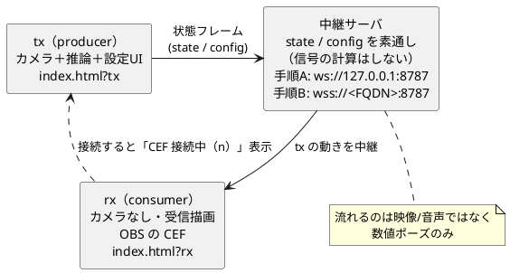

# WS 中継の接続手順（iPhone → サーバ → OBS の CEF）

`index.html?tx`（送信）と `index.html?rx`（受信）を中継サーバでつなぐ手順。
中継は `./doServer.sh`（中身は `npm run relay` = `server/relay.mjs`）、dev は `./doStartDev.sh`
（中身は `npm run dev`）で起動する。どちらも起動前にポートを解放し、tailscale があれば
証明書を自動解決して TLS（中継=WSS / dev=HTTPS）にする。
設計の背景は [05-OBSにカメラを触らせない代替案.md](05-OBSにカメラを触らせない代替案.md) を参照。

> **【前提】中継サーバはローカル/私設網での実行を想定**しています。認証・Origin 検証・ルーム
> 分離を持たないため、到達できる相手は誰でも他者のポーズ/設定を盗聴・偽装できます（流れるのは
> 映像/音声ではなく数値ポーズのみ）。運用は **同一PC の loopback（手順A）か、Tailscale など ACL で
> 閉じた私設網（手順B）に限定**してください。公開インターネットや不特定多数の LAN へは晒さない
> こと（晒すならトークン認証・ルーム ID を実装してから。詳細は
> [90-懸念事項.md](90-懸念事項.md)）。
>
> OBS を動かす **Windows 11 PC 1台だけ**で完結させたい（iPhone を使わない）場合は、
> 中継サーバに静的配信を相乗りさせた [09-Windowsで動かす.md](09-Windowsで動かす.md) が最短。
> Vite を別に立てず、`npm start` か `windows\start-guruguru.bat` だけで動く。

役割:

- **tx（producer）**: カメラ＋推論を動かし、状態フレームを送る。設定 UI もここ。
- **rx（consumer）**: カメラを起動せず、受信した動きで描画する。OBS のブラウザソース用。
- **中継サーバ**: 受け取った state / config を素通しするだけ（信号の計算はしない）。



すべて `guruguru-avatar/` で実行する。初回は `npm install` を済ませておく。

## 手順A: PC 1台・2タブ（最短・TLS 不要）

`http://localhost` はブラウザが secure context 扱いなので、**localhost ならカメラが TLS なしで動く**。
依存ゼロで「推論 → 送信 → 中継 → 受信 → 描画」を一気に確認できる。

```bash
# ターミナル1: 中継サーバ（平文 ws・localhost 専用）
./doServer.sh    # ws://127.0.0.1:8787（中身は npm run relay）

# ターミナル2: dev サーバ
./doStartDev.sh  # http://localhost:5173（中身は npm run dev）
```

> 両スクリプトの**既定は localhost モード**（平文・localhost）なのでフラグは不要。明示するなら
> `--localhost`（`-l` / `--no-tls` / `NO_TLS=1` でも可）。素の `npm run relay` / `npm run dev` でも
> 同じだが、スクリプトは起動前に詰まったポートを自動解放する。別端末から繋ぐ手順B は `--tailscale`。

ブラウザで2つ開く（必ず `localhost` で。WSL でも Windows のブラウザから `localhost:5173` で届く）。

- 送信側(tx): `http://localhost:5173/index.html?tx` … カメラを許可して顔を動かす
- 受信側(rx): `http://localhost:5173/index.html?rx&obs=0`
  （`?rx` 単独だと OBS 向けに透過＋UI 非表示になる。タブで動作確認するときは `&obs=0` を付ける）

確認ポイント:

- tx タブの画面下に「**CEF 接続中（1）**」が出る（rx を閉じると「CEF 未接続」）。
- tx で顔を振る・口を開ける・首をかしげる → rx 側のアバターが同じ動きをする。
- rx はカメラを起動していない（受信した動きだけで描画）。

## 手順B: iPhone → サーバ → OBS の CEF（Tailscale・WSL2・実機）

iPhone は別端末なのでカメラに **HTTPS が必須**・WS も **WSS** が要る。さらに **WSL2 は Windows の
背後で NAT** されていて、同一 LAN の iPhone から WSL の IP には直接届かない（portproxy が要る）。
**Tailscale を WSL2 内で動かす**と、到達性（NAT 越え）と TLS（実証明書）を一度に解決できる
（portproxy もファイアウォール開放も不要）。以下はこの環境（hostname `wsl40`）で実際に通した手順。
自分の FQDN は `tailscale status --json | grep MagicDNSSuffix` で確認し、`wsl40.taild830ae.ts.net`
の部分を読み替える。

### 一度だけの準備

```bash
# WSL2 に Tailscale を導入して参加（systemd 有効なら tailscaled は自動起動）
curl -fsSL https://tailscale.com/install.sh | sh
sudo tailscale up                     # 表示される URL でログイン
sudo tailscale set --operator=$USER   # 以降 sudo なしで tailscale cert 等が使える
```

- iPhone にも Tailscale アプリを入れ、**同じアカウント**でログイン。
- **OBS を動かす Windows も** Tailscale を入れて同じアカウントで参加させる。MagicDNS の
  名前解決は tailnet 参加デバイスでだけ効くので、未参加だと OBS(rx) が
  `DNS_PROBE_FINISHED_NXDOMAIN` でページを開けない（＝ページを開く端末は tx/rx とも全部 tailnet に入れる）。
- 管理コンソールの DNS 設定で **HTTPS Certificates を ON**（`tailscale cert` に必要）。

### 証明書（自動発行）

`./doServer.sh --tailscale` / `./doStartDev.sh --tailscale` は tailscale から FQDN を取得し、
`<FQDN>.crt` / `<FQDN>.key` が無ければ `tailscale cert <FQDN>` で自動発行する（両スクリプトで
同じ証明書を共有）。手動で先に作るなら:

```bash
tailscale cert wsl40.taild830ae.ts.net
# → wsl40.taild830ae.ts.net.{crt,key} が生成される
# operator 未設定なら: sudo tailscale cert … → sudo chown $USER wsl40.taild830ae.ts.net.*
```

証明書・秘密鍵はコミットしない（`.gitignore` で `*.crt` / `*.key` / `*.pem` を除外済み）。

### サーバ起動（TLS 付き）

```bash
# ターミナル1: 中継（WSS・0.0.0.0 に自動バインド）
./doServer.sh --tailscale
# ターミナル2: dev（HTTPS）
./doStartDev.sh --tailscale
```

`--tailscale`（`-t` / `--tls` / `TLS=1` でも可）でモードB に切り替わり、両スクリプトとも FQDN 取得・証明書解決・
適切なバインド（中継=WSS で `0.0.0.0`、dev=HTTPS）まで自動で行う。tailscale が無い／証明書を
出せないときは警告のうえ平文（ws / http＝モードA）にフォールバックする。

> 中継サーバの既定バインドは `127.0.0.1`（同一PC・loopback）。iPhone など別端末から繋ぐには
> `0.0.0.0` バインドが必須で、`./doServer.sh --tailscale` は自動で行う。素の `npm run relay` を手で使う
> 場合は `npm run relay -- --host 0.0.0.0`（環境変数 `RELAY_HOST=0.0.0.0` でも同じ）を付け、
> `RELAY_CERT` / `RELAY_KEY` で証明書を渡す。

### 各端末で開く（両方 Tailscale ON）

- iPhone(tx): `https://wsl40.taild830ae.ts.net:5173/index.html?tx`
- OBS の CEF(rx): ブラウザソースに `https://wsl40.taild830ae.ts.net:5173/index.html?rx`
  （`?rx` は OBS 用に既定で透過＋UI 非表示。`&obs=1` を付けても同じ）

iPhone 側に「**CEF 接続中（n）**」が出れば結線 OK。設定（感度・口・ズーム等）は iPhone で変更すると、
変更時に CEF へ送られて反映される（数秒ごとの再送はしない）。

注意:

- 中継を WSS にしたら **rx（OBS）も上の https URL にする**。手順A の `http://localhost` + 平文 `ws://`
  の組み合わせとは混在できない（mixed-content）。
- relay URL は自動で `wss://wsl40.taild830ae.ts.net:8787` に解決され、証明書名と一致する。
- 動作確認: `curl https://wsl40.taild830ae.ts.net:5173/index.html` が **`-k` なしで 200**
  なら、証明書が信頼されている（＝ iPhone でも警告なく開ける）。
- `DNS_PROBE_FINISHED_NXDOMAIN` が出たら、その端末が tailnet に参加していない。`tailscale status`
  に出るデバイスからしか MagicDNS 名は引けない（Windows なら Tailscale をインストールしてログイン）。

## URL パラメータ早見表

中継まわりの抜粋。`?obs` / `?avatar` / `?camera` を含む**全パラメータ**は
[16-URLパラメータ一覧.md](16-URLパラメータ一覧.md) にまとめてある（影は URL ではなく Tweaks 値）。

| パラメータ | 意味 |
| --- | --- |
| `?tx` / `?tx=ws` | 送信側（カメラ＋推論＋設定 UI） |
| `?rx` / `?rx=ws` | 受信側（カメラなし・受信描画）。OBS 用に既定で透過＋UI 非表示 |
| `?relay=<url>` | 中継 URL を明示（既定: ページと同ホストの `:8787`） |
| `?obs=1` | 背景透過＋UI 非表示を明示 ON（rx 以外でも有効） |
| `?obs=0` | 透過＋UI 非表示を明示 OFF（rx をタブでデバッグするとき用） |

## つまずいたら

- **カメラが出ない**: `localhost` で開いているか。実機なら HTTPS か。WSL の IP 直打ちは
  secure context 外でカメラ不可。
- **CEF が「未接続」のまま**: 中継 URL/ポートと、`ws`↔`wss` の一致を確認。
  HTTPS ページから `ws://` は mixed-content で不可（`wss://` にする）。
- **rx が動かない**: tx 側で「CEF 接続中」になっているか、ブラウザのコンソールに WS エラーが
  出ていないかを確認。証明書未信頼だと WSS 接続が張れない。
- **ポート 8787 が使用中**: `./doServer.sh` は起動前に 8787 を自動解放する。別ポートにするなら
  `PORT=9000 ./doServer.sh`（素のコマンドなら `RELAY_PORT=9000 npm run relay`）で変更し、rx には
  `&relay=ws(s)://<host>:9000` を付ける。
- **8787 を解放だけしたい**: `DRY_RUN=1 ./doServer.sh`（起動せずポートだけ空ける）。
