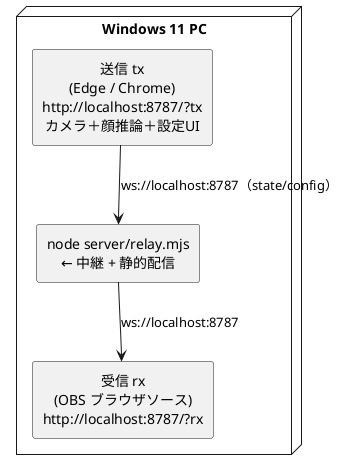

# Windows 11 で動かす（OBS 用ローカルサーバ・単一PC）

OBS を動かす **Windows 11 PC 1台の中だけ**で「送信ブラウザ(tx) → サーバ → OBS 受信(rx)」を
完結させる手順。すべて `localhost` で動くので **TLS も Tailscale も portproxy もファイアウォール
開放も不要**（iPhone を使う別端末構成は [08-WS中継の接続手順.md](08-WS中継の接続手順.md) を参照）。

ポイントは、中継サーバ（`server/relay.mjs`）に**静的配信を相乗りさせて1プロセス1ポートにまとめた**こと。
`npm run dev`（Vite）を別に立てる必要はなく、ビルド済みの `dist-local` をサーバが配る。

## 構成



- **tx（送信側）**: カメラと顔推論を動かし、状態フレームを送る。感度・口・ズーム等の設定 UI もここ。
- **rx（受信側）**: カメラを起動せず、受信した動きで描画するだけ。OBS のブラウザソース用。
- **サーバ**: 受け取った state / config を rx へ素通しし、同じポートで `index.html` 等も配る。

## 手順

### 1. Node.js を入れる（初回のみ）

PowerShell で:

```powershell
winget install OpenJS.NodeJS.LTS
```

インストール後はウィンドウを開き直す（PATH 反映のため）。`node -v` が `v20` か `v22` を返せば OK。

### 2. ビルドする（初回・更新時）

`guruguru-avatar\` フォルダで（`package.json` のある場所）:

```bat
npm install
npm run build:local
```

`build:local` は base を `/` にしたビルドを `dist-local\` に出力する（GitHub Pages 用の
`npm run build` とは別物。あちらは base `/guruguru-avatar/`）。

### 3. サーバを起動する

**かんたん起動（推奨）**: `windows\start-guruguru.bat` をダブルクリック。
Node 確認 → 必要なら自動ビルド → サーバ起動 → 送信側ブラウザを自動で開き、OBS 用の rx URL を表示する。

**手動で起動する場合**:

```bat
npm start
```

これは `node server/relay.mjs --web-root dist-local` を実行する（既定ポート `8787` /
バインド `127.0.0.1`）。`[relay] listening on ws://127.0.0.1:8787` と
`[relay] serving static: ...dist-local` が出れば起動成功。

### 4. 送信側(tx)を開く

Edge か Chrome で:

```text
http://localhost:8787/?tx
```

カメラを許可して顔を動かす。`localhost` は secure context なので **TLS なしでカメラが動く**。

### 5. OBS に受信側(rx)を設定する

OBS で「ソース」→「**ブラウザ**」を追加し、次を設定:

| 項目 | 値 |
| --- | --- |
| URL | `http://localhost:8787/?rx` |
| 幅 / 高さ | 配置したいサイズ（例 `1080` × `1080`） |
| カスタム CSS | 空でよい |

`?rx` は OBS 用に**背景が透過**し UI が消える（既定）ので、そのままオーバーレイにできる。
tx 側の画面下に「**CEF 接続中（1）**」が出れば結線 OK。tx で顔を振る・口を開けると rx が同調する。

## よく使うオプション

| やりたいこと | コマンド |
| --- | --- |
| ポートを変える | `node server/relay.mjs --web-root dist-local --port 9000` |
| LAN の別PCからも開く | `node server/relay.mjs --web-root dist-local --host 0.0.0.0`（要ファイアウォール許可） |
| WS 中継だけ動かす | `npm run relay`（静的配信なし・`127.0.0.1:8787`） |

ポートを 8787 以外にしたら、rx/tx の URL もそのポートに合わせる。中継 URL は
「ページと同じホスト・ポート」に自動解決されるので、`?relay=` を足す必要はない。

## tx を OBS の中で動かしたい場合

基本は **tx を Edge/Chrome、rx を OBS** に分けるのが簡単。どうしても tx も OBS の
ブラウザソースで動かす（＝カメラを OBS の CEF に触らせる）なら、OBS を
`--enable-media-stream` 付きで起動する必要がある（rx は受信専用なのでフラグ不要）。
詳細は [04-OBSでライブ配信.md](04-OBSでライブ配信.md) を参照。

## つまずいたら

- **カメラが出ない**: tx を `http://localhost:...` で開いているか（`127.0.0.1` でも可）。
  IP 直打ちや `file://` は secure context 外でカメラ不可。
- **rx が真っ黒 / 動かない**: tx 側が「CEF 接続中」になっているか。OBS のブラウザソースを
  右クリック →「**キャッシュを更新**」で再読込してみる。
- **ポート 8787 が使用中**: `--port 9000` 等に変え、rx/tx の URL も合わせる。
- **`build:local` を忘れている**: `dist-local\index.html` が無いと静的配信が 404 になる。
  `npm run build:local` を実行する（`.bat` 起動なら自動で実行される）。
- **コードを更新した**: `npm run build:local` をやり直す（`dist-local` を作り直す）。

## Node も Bun も入れずに配る（単体 EXE）

配布先に Node も Bun も入れたくない場合は、`guruguru-relay.exe`（中継 + 静的配信・
ランタイム同梱）に固めて `dist-local\` と一緒に配れる。作り方は
[10-単体EXEにする.md](10-単体EXEにする.md) を参照。
