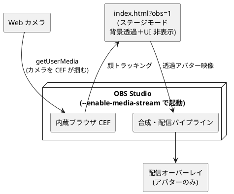

# OBS でライブ配信（ブラウザソース透過オーバーレイ）

カメラ版アバター（`index.html`）を OBS の **ブラウザソース**として読み込み、
**背景透過でアバターだけ**を配信オーバーレイにするための手順メモ。

> **スコープ**: 本ページはローカル直 OBS（中継なし）の手順です。WS 中継でブラウザを軽くする方法は [11-WS中継.md](11-WS中継.md) / [56-relay-mode.md](56-relay-mode.md) を参照してください。

関連: [01-使い方.md](01-使い方.md)

## 全体像

- OBS の「ブラウザソース」に `index.html?obs=1` を読ませる。
- `?obs=1`（ステージモード）で背景が透過し、UI が隠れてアバターだけになる。
- 顔トラッキングは OBS 内蔵ブラウザ(CEF)の中で動く（カメラを CEF が掴む）。
- **最重要**: OBS を `--enable-media-stream` 付きで起動しないとカメラが使えない（後述）。



## ステージモードの URL パラメータ

`index.html` は URL パラメータで配信用の見た目に切り替わる（通常表示は無変更）。

- `?obs=1` … 背景透過＋UI 非表示（アバターのみのオーバーレイ）
- 影は Tweaks の「影の濃さ」（`shadow`、0〜6）で調整する（旧 `?shadow=n` は廃止）。`T` キーで
  パネルを開いて変更でき、この方式（`?obs=1`・中継なしのローカル直 OBS）では調整値は
  localStorage に保存され次回も維持される（config 同期は `?tx` → `?rx` の relay モードのみ）
- ステージモード中だけ **`T` キー**で Tweaks パネルを開閉できる（OBS の「対話」で較正する用）

例: `http://localhost:5173/index.html?obs=1`

## 必須: OBS を `--enable-media-stream` 付きで起動する

OBS の内蔵ブラウザ(CEF)は **既定でカメラ/マイク（getUserMedia）を全面ブロック**する。
このフラグ無しだと、ユーザー操作があっても許可ダイアログすら出ず
`NotAllowedError: Permission denied`（`permissions.camera: prompt` のまま）になる。

### Windows: ショートカットを編集（常設・おすすめ）

1. OBS を**完全に終了**（タスクトレイのアイコンからも終了）
2. スタートメニューの「OBS Studio」を右クリック →「ファイルの場所を開く」
3. OBS のショートカットを右クリック →「プロパティ」
4. 「リンク先」の末尾（**閉じ引用符の外**）に半角スペース＋フラグを追加:

   ```text
   "C:\Program Files\obs-studio\bin\64bit\obs64.exe" --enable-media-stream
   ```

5. 「作業フォルダー」は `C:\Program Files\obs-studio\bin\64bit` のままにする
   （変更しない。OBS はここから起動する必要がある）
6. OK →**このショートカットから OBS を起動**

### コマンドで起動（一回試すだけ）

```text
cd /d "C:\Program Files\obs-studio\bin\64bit"
obs64.exe --enable-media-stream
```

### それでも通らない場合

許可を自動承認させるフラグを足す:

```text
obs64.exe --enable-media-stream --use-fake-ui-for-media-stream
```

> 検証実績: Windows + OBS（執筆時 32.0.1）+ `localhost` で、**`--enable-media-stream`（方法A）だけで解決**。

## OBS 側のセットアップ

1. ソース → 追加 → 「ブラウザ」
2. URL:
   - dev: `http://localhost:5173/index.html?obs=1`
   - 本番: `https://tommie-jp.github.io/guruguru-avatar/index.html?obs=1`
3. 幅・高さ: 1280×720 か 1920×1080
4. 「ソースが非アクティブのときシャットダウン」OFF（トラッキングを温存）
5. ソースを右クリック →「対話」でカメラ許可の確認、`T` キーで Tweaks を出して較正
6. **より軽い受信側方式（推奨）**: `index.html?rx` を OBS のブラウザソースに指定すると、
   顔トラッキングを OBS 外で行い OBS は受信のみにできる（→ [11-WS中継.md](11-WS中継.md)）

## カメラ許可の確認のしかた

`?obs=1` だとエラー表示が隠れる。原因を見たいときは一時的に `?obs=1` を外して
（`index.html` だけにして）「対話」で開くと、画面下にステータスが出る。

- 「顔を検出中」… 成功
- 「エラー: Permission denied」… 下のトラブルシュートへ

カメラ失敗時は画面中央に**エラー詳細パネル**が出る（`?obs=1` でも表示される）。
ここに `エラー名 / secure context / permissions.camera / カメラ検出数 / UA` が出るので
原因の切り分けに使う。パネルの「クリックしてカメラを開始（許可）」ボタンは、
ユーザー操作起点で getUserMedia を呼び直す（フラグを付けた後の確認に使える）。

## トラブルシュート（エラー名別）

- `NotAllowedError` / `permissions.camera: prompt`
  → OBS がカメラをブロック。`--enable-media-stream` で起動する（上記）。
- 「…localhost か HTTPS で開いてください」
  → secure origin でない。URL を `localhost` か `https` にする（IP 直打ち不可）。
- `NotReadableError` / Device in use
  → カメラ占有。他アプリ・OBS の「映像キャプチャデバイス」・Chrome のタブを閉じる。
- `NotFoundError` / カメラ検出数 0
  → カメラ未検出。接続・ドライバ・Windows のカメラ権限を確認。

### Windows のカメラ権限（前提）

設定 → プライバシーとセキュリティ → カメラ で全部オン:

- 「カメラへのアクセス」
- 「アプリにカメラへのアクセスを許可する」
- 「デスクトップ アプリがカメラにアクセスできるようにする」

## メモ

- 「対話」ウィンドウの黒背景は対話画面の背景で、実際の合成は透過。
  プレビュー/配信では後ろのソースが透ける。
- 多くの Web カメラは 1 アプリ占有。OBS のブラウザソースだけがカメラを使う状態にする。
- `--enable-media-stream` は OBS 全体（全ブラウザソース）に効く。
