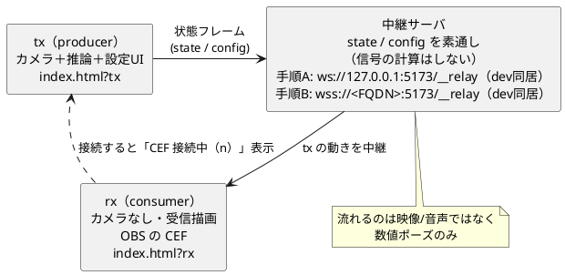

# WS 中継の接続手順（iPhone → サーバ → OBS の CEF）

`index.html?tx`（送信）と `index.html?rx`（受信）を中継でつなぐ手順。
dev（`./doStartDev.sh` = `npm run dev`）は Vite が WS 中継を同居させる（専用パス `/__relay`）ので、
**dev では別途 `./doServer.sh` / `npm run relay` を立てる必要はない**（`npm run dev` だけで tx/rx が通る）。
`./doServer.sh`（中身は `npm run relay` = `server/relay.mjs`）は **standalone・別マシン中継用**として存続する。
どちらも起動前にポートを解放し、tailscale があれば証明書を自動解決して TLS（中継=WSS / dev=HTTPS）にする。
設計の背景は [56-OBSにカメラを触らせない代替案.md](56-OBSにカメラを触らせない代替案.md) を参照。

> **【前提】中継サーバはローカル/私設網での実行を想定**しています。認証・Origin 検証・ルーム
> 分離を持たないため、到達できる相手は誰でも他者のポーズ/設定を盗聴・偽装できます（流れるのは
> 映像/音声ではなく数値ポーズのみ）。運用は **同一PC の loopback（手順A）か、Tailscale など ACL で
> 閉じた私設網（手順B）に限定**してください。公開インターネットや不特定多数の LAN へは晒さない
> こと（晒すならトークン認証・ルーム ID を実装してから。詳細は
> [90-懸念事項.md](90-懸念事項.md)）。
>
> **dev 同居の中継は既定で loopback 限定**です。Vite が WSL/`VITE_HOST=1` で `0.0.0.0` にバインド
> していても、中継だけは loopback のみ受理します。LAN へ公開するときは `RELAY_EXPOSE=1` で明示的に
> オプトインしてください（無認証 WS なので信頼できる私設網のみ。流れるのは数値ポーズのみで RCE は
> 起きませんが、偽フレーム注入・盗聴は可能です）。
>
> OBS を動かす **Windows 11 PC 1台だけ**で完結させたい（iPhone を使わない）場合は、
> 中継サーバに静的配信を相乗りさせた [14-Windowsで動かす.md](14-Windowsで動かす.md) が最短。
> Vite を別に立てず、`npm start` か `windows\start-guruguru.bat` だけで動く。

役割:

- **tx（producer）**: カメラ＋推論を動かし、状態フレームを送る。設定 UI もここ。
- **rx（consumer）**: カメラを起動せず、受信した動きで描画する。OBS のブラウザソース用。
- **中継サーバ**: 受け取った state / config を素通しするだけ（信号の計算はしない）。



すべて `guruguru-avatar/` で実行する。初回は `npm install` を済ませておく。

## 手順A: PC 1台・2タブ（最短・TLS 不要）

`http://localhost` はブラウザが secure context 扱いなので、**localhost ならカメラが TLS なしで動く**。
依存ゼロで「推論 → 送信 → 中継 → 受信 → 描画」を一気に確認できる。

```bash
# dev サーバ（WS 中継を同居・doServer.sh は不要）
./doStartDev.sh  # http://localhost:5173（中身は npm run dev）
```

> dev（`npm run dev`）が WS 中継を専用パス `/__relay` で同居させるので、`./doServer.sh` /
> `npm run relay` を別ターミナルで立てる必要はない。**既定は both モード**で、PC は
> `http://localhost:5173`、iPhone/OBS は `https://<FQDN>:5173` を1回の起動で同時に使える
> （tailscale が使えなければ自動で localhost のみに降格）。この手順Aのように localhost だけで
> 良いなら `--localhost`（`-l` / `--no-tls` / `NO_TLS=1`）で proxy を立てず平文に固定できる。
> スクリプトは起動前に詰まったポートを自動解放する。both の詳細は手順Bを参照。

ブラウザで2つ開く（必ず `localhost` で。WSL でも Windows のブラウザから `localhost:5173` で届く）。

- 送信側(tx): `http://localhost:5173/index.html?tx` … カメラを許可して顔を動かす
- 受信側(rx): `http://localhost:5173/index.html?rx&obs=0`
  （`?rx` 単独だと OBS 向けに透過＋UI 非表示になる。タブで動作確認するときは `&obs=0` を付ける）

確認ポイント:

- tx タブの画面下に「**CEF 接続中（1）**」が出る（rx を閉じると「CEF 未接続」）。
- tx で顔を振る・口を開ける・首をかしげる → rx 側のアバターが同じ動きをする。
- rx はカメラを起動していない（受信した動きだけで描画）。

## 手順B: iPhone → サーバ → OBS の CEF（Tailscale・WSL2・実機）

iPhone は別端末なのでカメラに **HTTPS が必須**・WS も **WSS** が要る。さらに **WSL2 は Windows の
背後で NAT** されていて、同一 LAN の iPhone から WSL の IP には直接届かない（portproxy が要る）。
**Tailscale を WSL2 内で動かす**と、到達性（NAT 越え）と TLS（実証明書）を一度に解決できる
（portproxy もファイアウォール開放も不要）。以下はこの環境（hostname `wsl40`）で実際に通した手順。
自分の FQDN は `tailscale status --json | grep MagicDNSSuffix` で確認し、`wsl40.taild830ae.ts.net`
の部分を読み替える。

### 一度だけの準備

```bash
# WSL2 に Tailscale を導入して参加（systemd 有効なら tailscaled は自動起動）
curl -fsSL https://tailscale.com/install.sh | sh
sudo tailscale up                     # 表示される URL でログイン
sudo tailscale set --operator=$USER   # 以降 sudo なしで tailscale cert 等が使える
```

- iPhone にも Tailscale アプリを入れ、**同じアカウント**でログイン。
- **OBS を動かす Windows も** Tailscale を入れて同じアカウントで参加させる。MagicDNS の
  名前解決は tailnet 参加デバイスでだけ効くので、未参加だと OBS(rx) が
  `DNS_PROBE_FINISHED_NXDOMAIN` でページを開けない（＝ページを開く端末は tx/rx とも全部 tailnet に入れる）。
- 管理コンソールの DNS 設定で **HTTPS Certificates を ON**（`tailscale cert` に必要）。

### 証明書（自動発行）

`./doServer.sh --tailscale` / `./doStartDev.sh --tailscale` は tailscale から FQDN を取得し、
`<FQDN>.crt` / `<FQDN>.key` が無ければ `tailscale cert <FQDN>` で自動発行する（両スクリプトで
同じ証明書を共有）。手動で先に作るなら:

```bash
tailscale cert wsl40.taild830ae.ts.net
# → wsl40.taild830ae.ts.net.{crt,key} が生成される
# operator 未設定なら: sudo tailscale cert … → sudo chown $USER wsl40.taild830ae.ts.net.*
```

証明書・秘密鍵はコミットしない（`.gitignore` で `*.crt` / `*.key` / `*.pem` を除外済み）。

### サーバ起動（TLS 付き）

dev が WS 中継を同居（`/__relay`）するので、別端末配信でも起動は **1 つだけ**でよい:

```bash
./doStartDev.sh               # 既定=both: PC=http://localhost:5173 と iPhone/OBS=https://<FQDN>:5173 を同時
```

**既定の both モード**は、vite を http のまま `127.0.0.1` に縛り、TLS リバースプロキシ
（`server/dev-tls-proxy.mjs`）を tailscale IP に立てて HTTPS を終端する。FQDN/IP/証明書は
tailscale から動的取得し、無ければ `tailscale cert <FQDN>` で発行を試みる。tailscale が無い／
証明書を出せないときは警告のうえ localhost 専用 http に降格する。

> **both の中継は loopback のまま**（`RELAY_EXPOSE` 不要）。proxy が `127.0.0.1` から中継へ繋ぐので
> 中継は loopback 判定で受理され、tailnet へは TLS 終端した proxy 経由でのみ届く（旧 `--tailscale` が
> 中継を生公開していたのより安全）。無認証 WS であることは変わらないので私設網でのみ使うこと。
>
> **旧来モード**: `./doStartDev.sh --tailscale`（`-t` / `--tls` / `TLS=1`）は vite 自身が直接 HTTPS
> 配信する（localhost http は使えない／中継を `RELAY_EXPOSE=1` で tailnet 公開）。互換のため残す。
> 素の `npm run dev` を手で HTTPS 配信するなら従来どおり `VITE_TLS_CERT` / `VITE_TLS_KEY` を渡す。
>
> **中継を別マシンに置く構成**（dev と中継を分離したいとき）だけ standalone を併用する: 別ターミナルで
> `./doServer.sh --tailscale`（WSS・`0.0.0.0`・既定 8787）を立て、各端末の URL に
> `&relay=wss://<host>:8787` を明示して同一オリジンの既定 `/__relay` を上書きする。素の `npm run relay`
> を手で使うなら `npm run relay -- --host 0.0.0.0`（`RELAY_HOST=0.0.0.0` でも可）＋ `RELAY_CERT` / `RELAY_KEY`。

### 各端末で開く（両方 Tailscale ON）

- iPhone(tx): `https://wsl40.taild830ae.ts.net:5173/index.html?tx`
- OBS の CEF(rx): ブラウザソースに `https://wsl40.taild830ae.ts.net:5173/index.html?rx`
  （`?rx` は OBS 用に既定で透過＋UI 非表示。`&obs=1` を付けても同じ）

iPhone 側に「**CEF 接続中（n）**」が出れば結線 OK。設定（感度・口・ズーム等）は iPhone で変更すると、
変更時に CEF へ送られて反映される（数秒ごとの再送はしない）。

注意:

- 中継を WSS にしたら **rx（OBS）も上の https URL にする**。手順A の `http://localhost` + 平文 `ws://`
  の組み合わせとは混在できない（mixed-content）。
- relay URL は自動でページと同一オリジンの `wss://wsl40.taild830ae.ts.net:5173/__relay` に解決される
  （dev が中継を同居）。証明書はページ（:5173）のものを使うので FQDN と一致する。別マシン中継を使う
  ときだけ `&relay=wss://<host>:8787` を明示する。
- 動作確認: `curl https://wsl40.taild830ae.ts.net:5173/index.html` が **`-k` なしで 200**
  なら、証明書が信頼されている（＝ iPhone でも警告なく開ける）。
- `DNS_PROBE_FINISHED_NXDOMAIN` が出たら、その端末が tailnet に参加していない。`tailscale status`
  に出るデバイスからしか MagicDNS 名は引けない（Windows なら Tailscale をインストールしてログイン）。

## URL パラメータ早見表

中継まわりの抜粋。`?obs` / `?avatar` / `?camera` を含む**全パラメータ**は
[16-URLパラメータ一覧.md](16-URLパラメータ一覧.md) にまとめてある（影は URL ではなく Tweaks 値）。

| パラメータ | 意味 |
| --- | --- |
| `?tx` / `?tx=ws` | 送信側（カメラ＋推論＋設定 UI） |
| `?rx` / `?rx=ws` | 受信側（カメラなし・受信描画）。OBS 用に既定で透過＋UI 非表示 |
| `?relay=<url>` | 中継 URL を明示（既定: ページと同一オリジン（`host:port`）＋ `/__relay`） |
| `?obs=1` | 背景透過＋UI 非表示を明示 ON（rx 以外でも有効） |
| `?obs=0` | 透過＋UI 非表示を明示 OFF（rx をタブでデバッグするとき用） |

## つまずいたら

- **カメラが出ない**: `localhost` で開いているか。実機なら HTTPS か。WSL の IP 直打ちは
  secure context 外でカメラ不可。
- **CEF が「未接続」のまま**: 中継 URL/ポートと、`ws`↔`wss` の一致を確認。
  HTTPS ページから `ws://` は mixed-content で不可（`wss://` にする）。
- **別端末（iPhone/OBS）から繋がらない**: 既定の同居中継は loopback 限定。別端末は非 loopback なので
  `RELAY_EXPOSE=1` が要る。`./doStartDev.sh --tailscale` は自動で付く（素の dev なら
  `RELAY_EXPOSE=1 npm run dev`）。なお既定の中継先はページと同一オリジンの `/__relay`。別ポート/別マシンの
  standalone 中継（`./doServer.sh`）を使うときは各端末に `&relay=ws(s)://<host>:8787` を明示する。
- **rx が動かない**: tx 側で「CEF 接続中」になっているか、ブラウザのコンソールに WS エラーが
  出ていないかを確認。証明書未信頼だと WSS 接続が張れない。
- **ポート 8787 が使用中**: `./doServer.sh` は起動前に 8787 を自動解放する。別ポートにするなら
  `PORT=9000 ./doServer.sh`（素のコマンドなら `RELAY_PORT=9000 npm run relay`）で変更し、rx には
  `&relay=ws(s)://<host>:9000` を付ける。
- **8787 を解放だけしたい**: `DRY_RUN=1 ./doServer.sh`（起動せずポートだけ空ける）。
