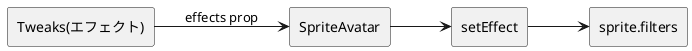

# カメラ版のエフェクト（PixiJS）

`index.html`（PixiJS スプライト描画版・旧 `camera2.html`）のアバターに掛けるエフェクトのしくみと、
追加できるエフェクトの一覧メモ。`camera.html`（img 切替版）はエフェクト非対応。

関連: [01-使い方.md](01-使い方.md) / [04-OBSでライブ配信.md](04-OBSでライブ配信.md)

## しくみ

- 描画は `src/sprite-avatar/`（再利用モジュール）。1枚の `<canvas>` に Pixi の `Sprite` を出し、
  正規化済み5×5シートの該当セルを `Texture` の frame で切り出して表示する。
- エフェクトは `renderer.js` の `setEffect(name, { enabled, ...params })` で管理。
  有効なフィルタを固定順で `sprite.filters` に並べる。
- `camera-app.jsx` の Tweaks「エフェクト」 → `effects` prop → `SpriteAvatar` → `setEffect`
  と流れる。設定は localStorage に永続化。

## 実装済み

- **発光（グロー）**: `effects/glow.js`（自作 GLSL）。周囲アルファを環状サンプリングして
  色付きハローを合成。パラメータは strength / color。
- **ディゾルブ**: `effects/dissolve.js`（自作 GLSL）。ノイズ＋しきい値で画素を欠き、縁に発光色を
  加算。パラメータは amount / color。

ブルームは不採用（下記「ハマりどころ」参照）。

## 追加できるエフェクト

安全で簡単なのは2系統。**(a) スプライト属性をいじるだけ（シェーダ不要）** と
**(b) 自作の単一パス GLSL（glow/dissolve と同方式・実証済み）**。

### a. 属性アニメ（シェーダ不要・最も簡単）

ticker で `sprite` の属性を毎フレーム更新するだけ。

- 色変え（`sprite.tint`）/ 虹色サイクル
- 明滅・フェード（`sprite.alpha`）
- ぷるぷる揺れ（位置を微振動）
- ぽよん（`scale.x` / `scale.y` を反比例）
- ゆらゆら回転（`rotation` を sin で揺らす）

### b. 単一パス GLSL（確実）

| 効果 | 見た目 | 補足 |
| --- | --- | --- |
| 色収差 | RGB ずれのグリッチ/レトロ | 簡単 |
| 波ゆらぎ | 水中/ゼリー | 要 time |
| モザイク | 粗いレトロ画 | 簡単 |
| 走査線 / CRT | ブラウン管 | 簡単 |
| ポスタライズ | アニメ塗り | 簡単 |
| 色調整 | 明るさ/コントラスト/彩度/色相 | 簡単 |
| グリッチ | RGB＋ブロックずれ＋ノイズ | 要 time |

動く系（波・グリッチ・明滅）は `uTime` を毎フレーム加算する土台を1回足せば共通で使える。

### c. やや手間

- パーティクル（`@pixi/particle-emitter`）でキラキラ/紙吹雪
- ディスプレイスメント（歪み地図テクスチャで揺らす）

## ハマりどころ

- **多パスフィルタは避ける**: pixi-filters の `AdvancedBloomFilter`（多パス）は v8 の既知バグで
  クラッシュしアバターが消える（[pixijs#10405](https://github.com/pixijs/pixijs/issues/10405)）。
  単一パスの自作 GLSL か属性アニメで作る。
- **`GlowFilter`（pixi-filters）は v8 のこの構成で描画されなかった** → 自作 GLSL に置換済み。
- **頂点・フラグメントで同じ uniform を使うなら精度を揃える**: `uInputSize` 等を両シェーダで
  宣言すると既定精度が食い違い `Could not initialize shader` になる。`uniform highp vec4 ...`
  で両方 highp に揃える。
- **加算光（glow）は明るい背景だと薄い**。暗い背景や強さ↑で出る。dissolve は画素改変なので
  背景に依存しない。
- **強い glow は cell 端で切れる**ことがある（cell に透過余白があるので中程度なら問題なし。
  伸ばすなら `filter.padding` 拡張）。

## 新しいエフェクトの足し方

1. `src/sprite-avatar/effects/<name>.js` に単一パス Filter を作る（`glow.js` / `dissolve.js` が雛形）。
2. `renderer.js` の `makeFilter` / `applyParams` / `EFFECT_ORDER` に1分岐ずつ足す。
3. `camera-app.jsx`: `TWEAK_DEFAULTS` にパラメータ、`effects` memo と Tweaks UI に項目を追加。
4. 動く系なら `uTime` を ticker で更新する共通土台を用意する。
