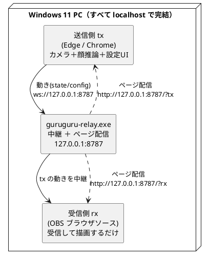
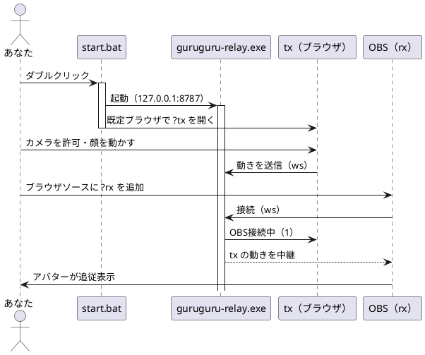

# Windows リレイサーバの使い方（OBS向け）

OBS で「ぐるぐるアバター」を透過オーバーレイ表示するための、Windows 用リリース zip
（`guruguru-relay.exe` + `dist-local` + `start.bat`）の使い方。ランタイムは exe に同梱されているので、
**Node も Bun もインストール不要**。
すべて `localhost` で動くので TLS もファイアウォール開放も要らない。

- ダウンロード: [リリースページ](https://github.com/tommie-jp/guruguru-avatar/releases/latest)
- 実行確認は Windows 11 でのみ行っています。

## しくみ（ざっくり）

- **送信側 tx** … Edge / Chrome でカメラと顔推論を動かす（感度・口・影などの設定 UI もここ）。
- **受信側 rx** … OBS のブラウザソース（＝**CEF**＝OBS 内蔵ブラウザ）。カメラは使わず、tx の動きで描画するだけ。
- **リレイサーバ** … tx の動きを rx へ中継し、同じポートでページも配る（`guruguru-relay.exe`）。

OBS 側(rx)はカメラを使わないので、**OBS に `--enable-media-stream` を付ける必要はない**
（カメラは tx 側のブラウザが担当する）。

## 全体の流れ

`start.bat` をダブルクリックしてから OBS に映るまでの流れ。

## 1. zip をダウンロードして展開する

1. リリースページから `guruguru-avatar-win-vX.Y.Z.zip` をダウンロードする。
2. **ローカルドライブに展開**する（例 `C:\guruguru`）。エクスプローラで右クリック →「すべて展開」。
   - zip の中身を直接ダブルクリックで実行しない（一時展開のままだと動かない）。
3. 展開すると `guruguru-obs-win\` の中に次が入っている。

   | ファイル | 役割 |
   | --- | --- |
   | `start.bat` | 起動用（これを実行する） |
   | `guruguru-relay.exe` | 中継 + 配信サーバ（ランタイム同梱・単体で動く） |
   | `dist-local\` | 配信物（アバターのページ・画像） |

## 2. start.bat を実行する

`start.bat` をダブルクリックすると、次が自動で行われる。

1. `guruguru-relay.exe` が `127.0.0.1:8787` で起動（最小化ウィンドウで常駐）。
2. 既定ブラウザで送信側 tx が開く → `http://127.0.0.1:8787/?tx`。
3. ウィンドウに tx / rx の URL が表示される。

ブラウザで**カメラを許可**して顔を動かすと、アバターが追従する。
`localhost` は secure context なので TLS なしでカメラが動く。

- 初回に **SmartScreen**（発行元不明）が出たら［詳細情報］→［実行］。
- サーバを止めるときは、最小化されている「guruguru-relay」ウィンドウを閉じる。

## 3. OBS に受信側(rx)を設定する

1. OBS で「ソース」→「＋」→「**ブラウザ**」を追加する。
2. 次のように設定する。

   | 項目 | 値 |
   | --- | --- |
   | URL | `http://127.0.0.1:8787/?rx` |
   | 幅 / 高さ | 配置したいサイズ（例 `1080` × `1080`） |
   | ソースが非アクティブのときシャットダウン | OFF（接続を温存する） |

3. `?rx` は**背景透過＋UI 非表示**（既定）なので、そのままオーバーレイにできる。

OBS 側はカメラを使わないため、`--enable-media-stream` の付与は不要。
tx も OBS の中で動かしたい（OBS の CEF にカメラを触らせる）上級者向けの話は
[10-OBSでライブ配信.md](10-OBSでライブ配信.md) を参照。

## 接続を確認する

- tx（ブラウザ）の画面下に「**OBS接続中（1）**」が出れば結線 OK
  （**CEF**＝OBS 内蔵ブラウザ。Chromium Embedded Framework の略で、OBS の「ブラウザ」ソースの実体。
  rx はこの CEF の中で動く。数字は接続中の OBS ブラウザソース数）。
- tx で顔を振る・口を開けると OBS の rx が同調する。
- 見た目の調整（影の濃さ・口・ズーム等）は tx で **`T` キー** → Tweaks パネル。
  変更した設定は rx(OBS) に同期される。

## つまずいたら

- **OBS が真っ黒 / 動かない**: tx 側が「OBS接続中」になっているか確認。OBS のブラウザソースを
  右クリック →「**キャッシュを更新**」で再読込する。
- **tx でカメラが出ない**: `http://localhost:...`（または `127.0.0.1`）で開いているか。IP 直打ち・
  `file://` は不可。Windows 設定 → プライバシーとセキュリティ → カメラ の許可も確認する。
- **ポート 8787 が使用中**: `start.bat` を編集して `--port 9000` 等に変える（rx/tx の URL も合わせる）。
- **LAN の別 PC からも開きたい**: `start.bat` の `--host` を `0.0.0.0` にする（要ファイアウォール許可）。

## もっと詳しく

- ソースからビルドして動かす（開発者向け）: [14-Windowsで動かす.md](14-Windowsで動かす.md)
- 単体 EXE の作り方: [53-単体EXEにする.md](53-単体EXEにする.md)
- OBS にカメラ自体を触らせる構成: [10-OBSでライブ配信.md](10-OBSでライブ配信.md)
- 公開済み zip の自動テスト: [55-リリースの動作テスト.md](55-リリースの動作テスト.md)
