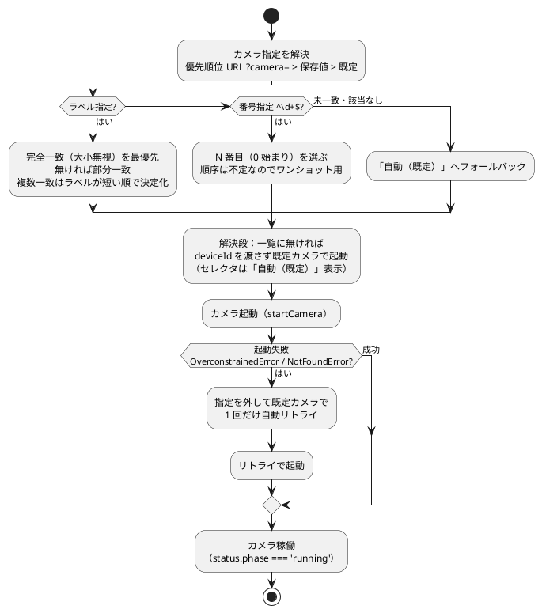

# カメラ切り替え

使うカメラを画面で選べる。選んだカメラは記憶し、`?camera=` で OBS シーンにも固定できる。
モバイル（iPhone tx 等）では前面/背面を切り替えられる。

関連: [08-WS中継の接続手順.md](08-WS中継の接続手順.md) / [09-Windowsで動かす.md](09-Windowsで動かす.md) / [14-テスト.md](14-テスト.md)

## 使い方（画面で選ぶ）

1. 右下の「Tweaks」を開く → 「カメラ」セクション。
2. プルダウンから使いたいカメラを選ぶ（接続中の videoinput が並ぶ）。
3. 選んだカメラは **記憶され、次回も同じカメラで起動**する（localStorage）。

カメラ名（ラベル）はブラウザがカメラ許可を出した**後**でしか取れないため、初回はカメラ起動後に
一覧が埋まる。「自動（既定）」を選ぶとブラウザ既定（最初のカメラ）に任せる。

## URL で固定する（OBS シーン用）

`?camera=<ラベル または 番号>` を付けると、その指定が**最優先**になり、セレクタは「URL固定」表示になる。

```text
http://localhost:8787/?rx                  ← 受信側は無関係（カメラ無し）
http://localhost:5173/index.html?tx&camera=Logitech   ← tx 側でカメラを固定
?camera=Front%20Camera                      ← 空白は URL エンコード
?camera=1                                    ← N 番目（0 始まり）
```

優先順位は **URL `?camera=` > 画面の保存値 > 既定**。

解決ルール（[camera-config.js](../src/camera-config.js) の `resolveCameraDevice`、純関数・テスト済み）:

- **ラベル**: 完全一致（大文字小文字を無視）を最優先、無ければ部分一致。複数一致は「ラベルが短い順」で決定化。
- **番号**: `^\d+$` は「N 番目（0 始まり）」。ただし**順序は再起動・抜き差しで変わりうる**ので、
  OBS など固定用途では**ラベル指定を推奨**（番号はワンショット用）。
- 未一致・該当なしは「自動（既定）」にフォールバック。

注意: `deviceId`（内部 ID）はブラウザ/プロファイル/OBS の CEF ごとに変わるため、URL では使わない。
ラベルなら環境をまたいでも安定する。`?camera=` と `?avatar=` は独立で衝突しない。

## 前面 / 背面（モバイル）

モバイル（タッチ可能端末）で、カメラが「自動（既定）」のときだけ「背面カメラ」トグルが出る。
ON で `facingMode: 'environment'`（背面）、OFF で `'user'`（前面）。特定カメラを明示選択している
ときは `facingMode` が無視されるためトグルは隠れる。iPhone では前面/背面が別カメラとして一覧に
出ることも多く、その場合はプルダウンでも切り替えられる。

## 記憶と「カメラが消えたとき」

- 保存するのは **カメラのラベル**（と `facingMode`）だけ。`deviceId` は保存しない（環境で変わるため）。
- 保存したカメラが次回見つからない場合は **2 段でフォールバック**:
  1. 一覧に無ければ deviceId を渡さず**既定カメラ**で起動（セレクタは「自動（既定）」表示）。
  2. 万一カメラ起動自体が失敗（`OverconstrainedError` / `NotFoundError`）したら、指定を外して
     **既定カメラで 1 回だけ自動リトライ**する（[use-face-pose.js](../src/face/use-face-pose.js) の `startCamera`）。

カメラ指定の解決から起動まで（優先順位と 2 段フォールバック）を図にすると次のとおり。



## 仕組み（実装メモ）

- 解決・整形・制約生成は純関数 [camera-config.js](../src/camera-config.js)（`parseCameraParam` /
  `resolveCameraDevice` / `formatCameraLabel` / `buildCameraConstraints`）に分離し、カメラ非依存で
  Vitest 単体テスト（`camera-config.test.js`）。
- カメラの再取得は `useFacePose` の `deviceId` / `facingMode` 依存で行う（推論エンジン切替と同じ
  cleanup→再 init）。値が実際に変わったときだけ再取得する。
- videoinput の列挙は、カメラ許可後（`status.phase === 'running'`）にコンポーネント側 effect で実行する。

既知の挙動: 既定以外のカメラを保存している場合、起動時に「既定で開く → 一覧取得 → 保存カメラへ
切り替え」と**一度だけカメラが切り替わる**（許可前はラベルが取れないため）。「自動（既定）」運用なら
切り替えは起きない。受信側（`?rx`）はカメラを持たないのでカメラ UI は出ない。

## 設計判断と経緯（このメモの背景）

導入前は切り替え UI が無く、`useFacePose` が `startWebcam` を引数なしで呼んでブラウザ既定
（最初の videoinput）に固定されていた。複数 web カメラ・OBS シーンごとの固定・iPhone の
前面背面に応えるため、既存の `?avatar=`＋`TweakSelect`＋`useTweaks` パターンに揃えて最小差分で追加した。

主要な設計判断（と理由）:

- **deviceId は保存せず「ラベル」を保存する。** `deviceId` の UUID はブラウザ/プロファイル/OBS の
  CEF ごとに変わり移植しない。ラベルなら環境をまたいでも安定するので、保存・`?camera=` ともラベル基準。
- **一覧の列挙はカメラ許可後に行う。** `enumerateDevices()` のラベルは getUserMedia 許可後でないと
  空になる（`camera-diagnostics.js` で確認済み）。よって列挙は `status.phase==='running'` を見て
  コンポーネント側 effect で実行し、`deviceId` 解決は純関数（`camera-config.js`）に分離した。
  こうすると「列挙結果を `useFacePose` の入力にする」循環を避けられる。
- **`?camera=` の優先順位は URL > 保存値 > 既定。** ラベルは完全一致優先→部分一致、複数一致は
  短いラベル優先で決定化。番号（N 番目）は `enumerateDevices` の順序が不定なので**ワンショット用**
  （OBS 固定はラベル推奨）。
- **再取得は推論エンジン切替と同じ仕組み。** `deviceId`/`facingMode` を `useFacePose` の依存配列に
  足し、値が変わったときだけ cleanup→init でカメラを取り直す。`useMemo` で安定化し、無関係な
  tweak（感度等）では再起動しない。
- **消失時は 2 段フォールバック。** 解決段で一覧に無ければ既定カメラ、起動段で失敗（Overconstrained/
  NotFound）なら deviceId を外して 1 回リトライ。
- **割り切り**: 既定以外を保存時の「起動時 1 回の切り替え」は、許可前にラベルが取れない制約上
  受け入れる（自動運用なら発生しない）。`deviceId` 指定時は `facingMode` は無視される（前面背面は
  自動時のみ）。

### テストと多エージェントレビュー

純関数（`camera-config.js`）は Vitest で単体テスト（`camera-config.test.js`、カメラ非依存）。
カメラ実機が要る経路（`useFacePose` の列挙・リトライ）は方針どおりテスト対象外（[14-テスト.md](14-テスト.md)）。

差分は多観点の自動レビュー（React 正しさ／エッジ・UX／純粋性・回帰）にかけ、確定した指摘のうち
有効なものを反映した:

- 反映: `startWebcam` の取得後失敗時の stream 解放（リーク防止）＋`loadedmetadata` の once 化／
  保存カメラ消失時にセレクタを「自動（既定）」へフォールバック／選択肢の `useMemo` 安定化／
  `localeCompare(…, 'en')` でロケール非依存化。
- 非反映（理由つき）: 起動時の二重列挙の抑止（USB 追加時の一覧更新を止める回帰になるため）／
  deviceId 選択時の `facingMode` 無視（既に正しい挙動・ドキュメント済み）／番号指定の不安定
  （「ワンショット用・ラベル推奨」と本メモに記載済み）。
