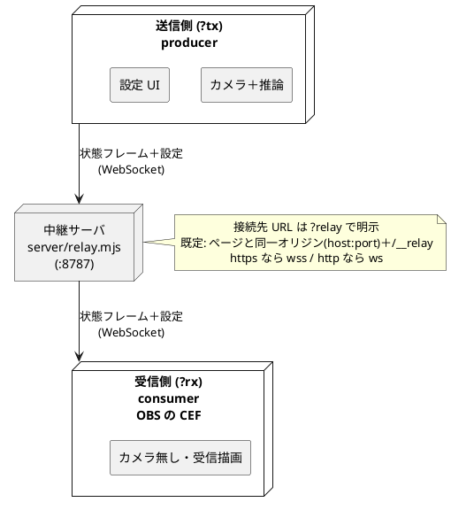

# URL パラメータ一覧

camera 版（`index.html`）が起動時に解析する URL クエリの早見表。これらは**起動時に一度だけ**
読まれ、途中変更は効かない（変えたら再読込）。`guruguru.html` / `talk.html` / `tracking.html`
は URL パラメータを読まない（camera 版専用）。

真偽フラグ（`tx` / `rx` / `obs`）は値なし・`1` / `true` / `yes` / `on` を「有効」とみなす
（`tx` / `rx` は `ws` も可）。`obs` だけは `0` / `false` で明示的に「無効」にできる。

## 早見表

| パラメータ | 値 | 意味 | 既定 |
| --- | --- | --- | --- |
| `?tx` | （フラグ）/ `=ws` | 中継の**送信側**（カメラ＋推論＋設定 UI）。[11](11-WS中継の接続手順.md) | local |
| `?rx` | （フラグ）/ `=ws` | 中継の**受信側**（カメラ無し・受信描画。OBS の CEF 用）。`obs` 既定 ON | local |
| `?relay` | `ws(s)://host:port` | tx/rx がつなぐ**中継サーバの WebSocket URL を明示**（下記詳細） | 同一オリジン（host:port）＋ `/__relay` |
| `?obs` | （フラグ）/ `1` / `0` | **ステージモード**（背景透過＋UI 非表示）。三状態。[10](10-OBSでライブ配信.md) | 未指定なら rx のとき ON |
| `?avatar` | `<id>` | 表示アバターを固定（OBS シーン用）。セレクタより優先。[31](31-アバターの追加.md) | 保存値／既定 |
| `?camera` | `<ラベル>` / `<番号>` | 使うカメラを固定（OBS シーン用）。[15](15-カメラ切り替え.md) | 保存値／既定 |

## グループ別の説明

### 中継（tx / rx / relay）

PC のブラウザや iPhone で推論して状態を送り（`tx`）、OBS の CEF が受信して描画する（`rx`）構成。



- `?tx` … producer。カメラ＋推論を動かし状態フレームを送信。設定 UI もここ。
- `?rx` … consumer。カメラを起動せず、受信した動きだけで描画。**OBS 用なので既定で透過＋UI 非表示**。
- `?relay=<url>` … 中継先 WebSocket を明示（下の「`?relay` の詳細」参照）。

`tx` と `rx` を同時指定したら `tx` を優先。詳細・接続手順は [11-WS中継の接続手順.md](11-WS中継の接続手順.md)。

#### `?relay` の詳細

`tx`（送信側）と `rx`（受信側＝OBS の CEF）は中継サーバ（`server/relay.mjs`）の WebSocket に
つなぎ、状態フレームと設定をやり取りする。その**接続先 URL** を決めるのが `?relay`。

既定値（省略時）の組み立てルール（`src/relay-mode.js` の `defaultRelayUrl`）:

- **ホスト** … ページと同じ（`location.host` ＝ hostname:port／同一オリジン）
- **パス** … 専用パス `/__relay`（HMR の `/` と衝突しないため）。`DEFAULT_RELAY_PORT`（8787 固定）は廃止
- **スキーム** … ページが https なら `wss`、http なら `ws`（mixed-content 回避）

つまり既定は「中継はページと同一オリジン（同じ host=hostname:port）の `/__relay`」を前提とする。
`npm run dev` では Vite が WS 中継を同居させる（`vite-plugin-relay.mjs`）ので、別途
`doServer.sh` / `npm run relay` を立てなくても `?tx` / `?rx` がそのまま中継できる。配信（`npm start` /
単体 EXE = `relay.mjs`）も page と WS が同じ 8787 ポートに同居するので、ユーザーが打つ URL や手順は
従来どおり（WS パスに `/__relay` が付くだけ）。これが崩れるときだけ明示する:

1. **中継が別マシン/別ポート** … 例 ページは静的配信、中継は別マシン → `?relay=wss://relay-box:8787`
   （standalone の `server/relay.mjs` / `npm run relay` / `doServer.sh` は別マシン用として存続）
2. **スキームを明示したい** … 自動判定と違うものを使いたいとき

要らないケース（既定で当たる）: `npm run dev`（Vite が中継を同居）、単体 EXE / `npm start`
（静的配信と WS が同じ 8787）、Tailscale dev（ページと中継が同一オリジン）。

注意:

- 値は `ws://` か `wss://` の完全な URL。https のページから `ws://`（平文）は **mixed-content で不可**
  （https なら必ず `wss://`）。
- `tx` / `rx` のときだけ意味を持つ（`local` モードは中継に接続しない）。
- **セキュリティ**: dev 同居の中継は既定で loopback 限定（Vite が WSL / `VITE_HOST=1` で `0.0.0.0`
  でも、中継だけは loopback のみ許可）。LAN へ公開したいときは `RELAY_EXPOSE=1` で明示オプトイン。
  無認証 WS なので信頼できる私設網のみで使う（流れるのは数値 pose のみで RCE は無いが、偽フレーム
  注入・盗聴は可能）。
- **起動時に一度だけ**解析・接続。`shadow` など表示値は接続後に tx→rx へ同期されるが、`?relay` は
  「接続先そのもの」なので同期対象ではなく、各端末がそれぞれ指定する（OBS はブラウザソースの URL
  に書けば永続する）。

### 表示・OBS（obs）

- `?obs` … 背景を透過し UI を全部隠す「ステージモード」。**三状態**で扱う:
  - 未指定 → `rx` のときだけ ON（OBS の CEF 受信を想定）、それ以外は OFF。
  - `?obs` / `?obs=1` → 常時 ON（`rx` でないローカル直 OBS でも透過したいとき）。
  - `?obs=0` → 常時 OFF（`rx` をブラウザのタブでデバッグするとき）。

> 影は**旧 `?shadow=n` を廃止**し、Tweaks の「影の濃さ」（`shadow`、0〜6）へ移行した。tx 側で
> 調整した値が config 同期で rx(OBS) に反映されるので、URL では指定しない。

仕組みと運用は [10-OBSでライブ配信.md](10-OBSでライブ配信.md) / [56-OBSにカメラを触らせない代替案.md](56-OBSにカメラを触らせない代替案.md)。

### 選択（avatar / camera）

OBS のシーンごとに「どのアバター・どのカメラ」を固定したいとき用。どちらも**セレクタより URL が優先**で、
指定中は Tweaks パネルに「URL固定」と表示される。

- `?avatar=<id>` … `id` は `src/character-config.js` の `avatars`（例 `01-tomari`）。未知・未指定は保存値／既定。
- `?camera=<ラベル|番号>` … ラベルは部分一致（大小無視・完全一致優先）。番号は N 番目（0 始まり・
  順序が不定なのでワンショット用、固定はラベル推奨）。優先は **URL > 保存値 > 既定**。詳細は
  [15-カメラ切り替え.md](15-カメラ切り替え.md)。

## 組み合わせ例

```text
# OBS のブラウザソース（受信側・本番）。?rx だけで透過オーバーレイ
https://<host>:5173/index.html?rx

# rx をブラウザのタブで動作確認（透過を切って UI を見る）
http://localhost:5173/index.html?rx&obs=0

# 送信側（PC で顔を動かす）
http://localhost:5173/index.html?tx

# iPhone を送信側に（カメラは HTTPS 必須）
https://<host>:5173/index.html?tx

# ローカル直 OBS（カメラを CEF で動かす・中継なし）。透過は ?obs=1 を明示
https://<host>:5173/index.html?obs=1

# OBS シーン固定（受信側でアバターとカメラを URL 指定）
https://<host>:5173/index.html?rx&avatar=01-tomari&camera=Logitech

# 中継サーバが別ホスト
https://<host>:5173/index.html?rx&relay=wss://relay-host:8787
```

## 注意

- ラベルやアバター id に空白・記号が入るときは URL エンコードする（`?camera=Front%20Camera`）。
- 各パラメータは独立で、同時指定しても衝突しない（`?rx&obs=0&avatar=…&camera=…` など）。
- 解析の実体は純関数: `src/relay-mode.js`（tx/rx/relay）・`src/obs-mode.js`（obs）・
  `src/camera-config.js`（camera）・`src/camera-app.jsx` 内 `parseAvatarParam`（avatar）。いずれも単体テスト付き。
- 影（`shadow`）は URL ではなく Tweaks 値。tx で調整 → config 同期で rx に反映される。
