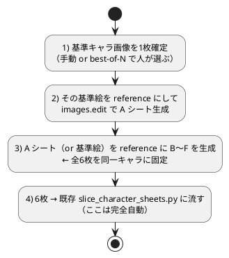

# ChatGPT-Image の自動化（アバター生成）

現在は Web 版 ChatGPT-Image を**手動操作**してアバターの角度シートを生成している。
これをスクリプトで自動化したい、という検討メモ。

関連: [13-アバター画像の生成AI.md](13-アバター画像の生成AI.md)（無料版の代替先）/
[12-アバターの追加.md](12-アバターの追加.md) / [templates/](templates/)

## 前提（今回の条件）

- OpenAI API キーは**これから取得を検討**する段階。
- 生成単位は**角度シート1枚（5×5グリッド）**。これをスライスして使う。

## 結論（推奨）

**まず無料で「配管＋実生成」を検証 → 本番だけ公式 OpenAI Images API に差し替える**二段構え。
中身のモデルは ChatGPT の画像生成と同じ。ブラウザ自動化は避ける。

- 無料で配管(slice)＋実生成まで試せる（後述「無料で試す経路」）。
- 本番は `gpt-image-1.5` / `gpt-image-1-mini`。`gpt-image-1` 系は**無料では1回も叩けない**
  （org 本人確認＋有料 Tier 必須）ので、検証は無料代替で行う。

## 選択肢の比較

| 観点 | ① 公式 API（`gpt-image-1.5` / `mini`）**推奨** | ② ブラウザ自動化（Playwright で Web 版操作） |
| --- | --- | --- |
| 中身のモデル | ChatGPT 画像生成と同じ | 同じ（Web UI 経由） |
| 規約 | 正規利用 | Web UI の自動操作は OpenAI 規約に抵触 |
| 安定性 | 高い（API 仕様が安定） | 低い（UI 変更・bot 検知・セッション管理で壊れやすい） |
| コスト | 従量課金（API キー必要） | ChatGPT Plus 内（ただし規約リスク） |
| 既存ツール連携 | Python から `slice_character_sheets.py` に直結 | ダウンロード処理を別途自動化が必要 |

継続運用するなら①一択。②は規約違反 × 壊れやすさの二重苦。

## 現行パイプラインの実態（自動化の前提）

`tools/slice_character_sheets.py` とスライス済み画像から読み取れる構成。

- **1キャラ = 6枚のシート**（表情状態 `A`〜`F`: 目開け口とじ … 目閉じ口開け）。
- 各シートが **5×5グリッド**（向き×上下の 25コマ）。
- 最終スライスは **1コマ 1200×1200px**（`decode_rgba` の `target_size` で
  小さめグリッドから 1200px へアップスケールしている）。

ここから言えること。

- **解像度の天井は今と同じ**。`gpt-image-1` 系の出力上限は 1536px で、
  5×5 だと 1コマ native 約300px → 1200px へ拡大。ただし ChatGPT Web 版も
  同程度で頭打ちなので、API に移しても**画質は今と同等（劣化しない）**。
- **本当の難所は「6枚×全コマの一貫性」**。自動化で速くなるのは試行回数で、
  一発成功率は上がらない。A〜F で「同じキャラ・目と口だけ違う」を揃えるのが肝。

## 無料で試す経路（検証用）

API キー取得・課金の前に、0円で「配管」と「実生成」を検証できる。本番の
`gpt-image-1` 系は無料では叩けないので、無料代替で検証 → 本番だけ差し替える。

### ① まず0円で配管(slice)を固める ＝ ネット・キー不要・最短

生成 AI を呼ばず、後半（PNG → `slice_character_sheets.py` → 25コマ×6）の動作を即確認。
このリポジトリに検証スクリプトを用意済み（実証 PASS 済み）。

```bash
./doVerifySlice.sh          # 透過ダミー6枚を生成→slice→150枚(25×6)を検証し PASS/FAIL
./doVerifySlice.sh --keep   # 出力を残して目視確認（パスを表示）
```

- 仕組み: `tools/make_dummy_sheets.py` が**透過背景＋25個の分離ブロブ**の5×5ダミーを
  `A`〜`F` 分生成し、slice にかけて 150枚が非空・全セル揃いかを確認する。出力はすべて
  一時ディレクトリで、本物の `public/slices2` は一切触らない。
- 補足: `templates/head-grid-*.png` は元は RGB（透過なし）だったが、`tools/key_template_bg.py`
  で**透過処理済み**（外周連結グレーのみキー抜き・内部の陰影は保持）。背景が不透明な素材を
  component-mode に流用するときは、同ツールで先に背景を透過させること
  （`python3 tools/key_template_bg.py <png...>`）。

### ② 無料 API で実生成まで試す ＝ Pollinations が本命

実装済み（実証 PASS）。`tools/gen_pollinations_sheets.py` ＋ `doGenPollinations.sh` で
「生成 → 背景除去 → 5×5×6シート → slice → 150枚」を一発実行できる。

```bash
./doGenPollinations.sh "chibi anime girl avatar, brown hair"  # 1体生成して配管を通す
./doGenPollinations.sh "..." --per-state  # A〜F を別シードで個別生成
./doGenPollinations.sh "..." --rembg      # 背景除去に rembg を使う(要 pip install rembg onnxruntime)
```

- 背景除去は既定 color（外周連結の単色キー抜き・依存ゼロ）。緑背景＋緑服でも外周連結
  方式なので服は残る。足元の影が少し残るなど簡易なので、品質を上げるなら `--rembg`。
- ⚠️ 現状は**同一キャラを25セルに敷き詰める**疎通テスト。25方向の作り分けは per-cell
  生成（1コマずつ生成 → パッキング）への拡張が必要（次段）。

- **Pollinations.ai** — 完全0円・**登録/キー不要**で唯一すぐ叩ける。`requests` の GET
  だけ。`seed` 固定で再現性、`model=kontext`＋参照画像 URL で img2img。混雑時 503 は
  リトライ前提・匿名出力は透かし有（`nologo` / 登録で除去）。
- **Cloudflare Workers AI** — 無料枠 10,000 Neurons/日・**クレカ不要**。FLUX.1 schnell は
  512px・4step で約 43 neurons/枚 → 1日 200 枚規模。ただし schnell は**参照画像非対応**
  （text→image のみ）。参照を使うなら SDXL(img2img) か flux-2 系。Account ID＋トークン要。
- **Google AI Studio（Web UI）** — キー不要・0円でモデル品質とキャラ一貫性を**目視検証**
  するのに最適（自動化は不可・手動）。Nano Banana 系は参照最大14枚・人物一貫性最大5人。

> ⚠️ **Gemini の画像 API 無料枠は当てにしない**。公式 pricing は画像モデルの Free tier を
> 「Not available」と明記。出回る「10RPM/500RPD 無料」は Imagen 3 の枠との混同で、画像
> 出力モデルに無料で通る保証は弱い。$300 クレジットも Gemini API/AI Studio には使えない。
> スクリプト自動化で確実に0円なら Pollinations / Cloudflare を優先する。

### ③ 本番は gpt-image-2（既定）/ 1.5 / mini ＝ 有料・要本人確認

実装済み（dry-run で配管 PASS）。`tools/gen_gptimage_sheets.py` ＋ `doGenGptImage.sh` が
`docs/01_画像生成用プロンプト.txt` のワークフロー（キャラ参照＋テンプレ＋■最初の指示 →
base A → 表情差分の連鎖編集 → A〜F）を `images.edit` で再現する。**既定は `gpt-image-2` で
グレー背景の A〜F を出力し、透過処理は後処理で行う**（手動ワークフローの「背景はグレー」と一致）。

```bash
./doGenGptImage.sh <キャラ参照画像> <id> --dry-run --slice  # キー不要で配管検証(0円)
./doGenGptImage.sh <キャラ参照画像> <id>                    # 既定: gpt-image-2 でグレー A〜F(透過は後処理)
./doGenGptImage.sh <キャラ参照画像> <id> --mini             # 安価ドラフト(gpt-image-1-mini)
./doGenGptImage.sh <キャラ参照画像> <id> --transparent      # gpt-image-1.5 で透過PNGを直接出力
# 後処理(グレー→透過＋正規化): ./doAvatarConvert.sh <出力dir> <id>
```

- **モデルの対応**: Web「Images 2.0」＝ API `gpt-image-2`（5×5一発の追従が最良だが**透過非対応・
  `input_fidelity` 不可**）。既定はこの `gpt-image-2`（グレー出力・透過は後処理）。透過を直接
  出したいときは `--transparent`（`gpt-image-1.5`＝透過＋忠実度を両立する現行唯一）。
- 連鎖: A(base, n=3) → A から D(目閉じ)/B(口中間)/C(口開け)、D から E/F（浅い枝でドリフト最小）。
  差分は「○○以外変更しない・全ポジションに適用」を付けて部分適用を防ぐ。
- 透過処理は既定 OFF（後処理で実施）。`--slice` を付けたときだけ自動で背景キー抜きして slice 検証
  する。後処理は `doAvatarConvert.sh`（グレー背景キー抜き＋正規化 → `slices2-sheets/<id>`）が使える。
- ⚠️ キャラ参照は**単体のキャラ画像1枚**を渡す（複数なら同一キャラの参照を入れたフォルダ）。
- 4倍アップスケールは API 単体では不可（size 上限 1536）→ Real-ESRGAN 等で別途。

### 無料ルート比較（2026-06 時点・変動前提）

| ルート | 0円 | キー | 参照画像 | 注意 |
| --- | --- | --- | --- | --- |
| head-grid 流用 / Pillow ダミー | ◎ | 不要 | — | 配管検証のみ・実画質は判定不可 |
| Pollinations.ai | ◎ | 不要 | ○(kontext) | 混雑時 503・匿名は透かし有 |
| Cloudflare Workers AI | ◯枠内 | 要(クレカ不要) | △(SDXL/flux-2) | schnell は 512px・参照非対応 |
| Google AI Studio (UI) | ◎ | 不要 | ○(14枚) | 一貫性最強だが**自動化不可** |
| Gemini Image API 無料枠 | ✕不確実 | 要 | ○ | 公式 Not available・自動化非推奨 |
| HF Inference | ◯極小 | 要(クレカ不要) | △(Kontext) | 無料 約$0.10/月相当・FLUX.1-dev は非商用 |

## コスト試算（本番・有料／生成単位＝6枚/キャラ）

⚠️ `gpt-image-1` は 2026-06 時点で旧モデル扱い、**2026-10-23 に廃止予定**。
新規実装は **`gpt-image-1.5` / `gpt-image-1-mini`** を前提にする。

価格感（2026-06 時点・1024px あたり・要再確認）。

| モデル / 品質 | 1枚 | 6枚＝1キャラ |
| --- | --- | --- |
| `gpt-image-1-mini` low | 約 $0.005 | 約 $0.03 |
| `gpt-image-1-mini` medium | 約 $0.011 | 約 $0.07 |
| `gpt-image-1-mini` high | 約 $0.036 | 約 $0.22 |
| `gpt-image-1.5` low/med/high | 約 $0.009 / $0.034 / $0.133 | 約 $0.05 / $0.20 / $0.80 |

運用は「**mini や low で詰める → 確定時のみ上げる**」。試行込みでも 1キャラ数十セント〜
数ドル規模。参照画像の入力トークンが別途加算。全出力に C2PA＋SynthID 透かし。
数値は変動が激しいので利用前に公式 pricing を再確認する。

## 登録（API キー取得）の最小チェックリスト

gpt-image 系（1.5 / mini 含む全モデル）は **org verification（本人確認）が必須**。回避する
正規手段は無く、本ワークフロー（キャラ参照＋テンプレを `images.edit` に添付）は DALL·E 3 では
代替不可。**1回通すのが正解**。面倒を最小化する順番:

| # | 手順 | 所要 | 支払い | 本人確認 |
| --- | --- | --- | --- | --- |
| 1 | OpenAI アカウント作成/ログイン（既存 ChatGPT アカ可・組織は個人既定でよい） | 約5分 | 不要 | 不要 |
| 2 | Billing にクレカ登録＋**最低 $5（推奨 $10）チャージ**（残高ゼロだと 402 で生成不可） | 約5分 | 必須 | 不要 |
| 3 | `settings/organization/general` →「Verify Organization」→ Persona へ。**スマホ完了が確実** | 約3分 | 不要 | 開始 |
| 4 | Persona 本人確認: 写真付き ID 撮影 ＋ **Liveness Check（顔を左右に振る 3D スキャン・自撮りではない）** | 約8分 | 不要 | 必須 |
| 5 | 反映待ち。完了後ステータス反映に**最大15〜30分**（混雑時は数時間〜数日）。「Verified」確認 | 約20分〜 | 不要 | — |
| 6 | `platform.openai.com/api-keys` で「Create new secret key」→ 即コピー → `OPENAI_API_KEY` へ | 約3分 | 不要 | 不要 |
| 7 | 疎通: `gpt-image-1-mini` で `images.edit` を1発（403=要verify反映待ち / 402=残高不足） | 約5分 | — | — |

スムーズなら**約30〜60分**。落とし穴:

- 「mini なら本人確認不要」は**誤り**。全 gpt-image 系で必須。
- **キーが属する組織を verify** する（別組織を verify しても 403 は消えない）。
- 1 ID は **90日に1回・1組織1 ID**。テストで組織を作り直すと引っかかる。
- **403（要verify）と 402（残高不足）は別物**。verify 済みでも残高ゼロだと生成不可。
- API キーは**環境変数のみ**（ハードコード禁止）。

## 一貫性を守る自動化戦略



ポイントは「**最初の1枚の確定は人が選び、残りの量産＋スライスを自動化**」すること。
完全無人より成功率と品質が安定する。

実装の肝は **`generate_sheet()` の中身だけ差し替える**こと。保存→slice の配管は共通なので、
無料(A) ↔ 本番(B) を関数1個の差し替えで往復できる。

```python
# ---- 共通の後半パイプライン（変えない）----
import subprocess, pathlib
STATES = "ABCDEF"            # 目開け口とじ … 目閉じ口開け
SRC = pathlib.Path("新キャラ資料")

def build_character(prompt_of):                 # prompt_of(state) -> str
    SRC.mkdir(exist_ok=True)
    for s in STATES:
        png = generate_sheet(s, prompt_of(s), ref_path=SRC / "A_ref.png")
        (SRC / f"{s}_sheet.png").write_bytes(png)
    subprocess.run(["python", "tools/slice_character_sheets.py",
                    "--source", str(SRC), "--slices-out", "/tmp/slices_test"], check=True)

# ---- (A) 0円検証: Pollinations（キー不要）----
import requests
from urllib.parse import quote
def generate_sheet(state, prompt, ref_path=None):
    r = requests.get(f"https://image.pollinations.ai/prompt/{quote(prompt)}",
                     params={"model": "flux", "width": 1024, "height": 1024,
                             "seed": 42, "nologo": "true"}, timeout=120)
    r.raise_for_status()
    return r.content                            # PNG bytes

# ---- (B) 本番: OpenAI（要本人確認＋課金）— この関数だけ差し替え ----
from openai import OpenAI
client = OpenAI()                               # OPENAI_API_KEY を環境変数で
def generate_sheet(state, prompt, ref_path=None):
    import base64
    r = client.images.edit(model="gpt-image-1-mini",
                           image=open(ref_path, "rb"),   # 基準絵で一貫性
                           prompt=prompt, size="1024x1024")
    return base64.b64decode(r.data[0].b64_json)
```

## 重要な注意（検証で確定）

- **5×5 一発生成の格子整列はモデル依存**。Web の Images 2.0（＝ API `gpt-image-2`）は一発で
  実用的に出るので、**本スクリプト既定は `gpt-image-2`（グレー出力・透過は後処理）**。透過を
  直接出したいときは `--transparent`（`gpt-image-1.5`＝透過＋忠実度を両立する現行唯一）。1.5 は
  整列が崩れ得るので base は `n=3` で候補生成 → 選別。無料の Pollinations/flux は5×5を正確に
  描けない。`--slice` を付けたときだけ自動で背景キー抜きして slice 検証する。
- **透過前提**。slice は前景アルファ前提（`alpha-threshold` / `component-mode`）なので、
  生成画像は `rembg` 等で背景除去してから流す。
- **商用不可**。本プロジェクトのアセットは非商用（`ASSET_LICENSE.md`）。無料枠は
  プロンプト/出力の学習利用・SynthID/C2PA 透かし・非商用モデルライセンス（FLUX.1-dev 等）が
  絡む。検証は可だが、商用配信を伴う本生成では各モデルのライセンスと透かしを必ず確認する。
- **無料枠は変動が激しい**。OpenAI の旧無料トライアルは廃止、Gemini も無料枠を縮小、
  モデル ID も短命。本番直前に各社公式 pricing / rate-limit を再確認する。

## 次の一手（TODO）

- [x] **①0円で配管検証**: `./doVerifySlice.sh` で透過ダミー→slice→150枚を検証（**PASS 済み**）。
- [x] **②無料 API で実生成**: `./doGenPollinations.sh` で Pollinations 生成→背景除去→slice→150枚を実証（**PASS 済み**）。
- [ ] **②拡張**: 25方向を per-cell 生成（1コマずつ→パッキング）して、敷き詰めでなく実シートにする。
- [ ] 生成→保存→slice を Python 1スクリプト（`generate_sheet()` 差し替え式）にまとめる。
- [x] **③本番スクリプト**: `doGenGptImage.sh`（docs プロンプト準拠・連鎖編集）実装、dry-run PASS。
- [ ] **③登録**: org verification を通し、既定の `gpt-image-2`（または `--mini`）で実生成・品質/費用を体感。
- [ ] 1枚5×5が安定しないなら「1コマ生成→パッキング」or ローカル ComfyUI を検討。

## 参考リンク

- [OpenAI Images API（公式ドキュメント）](https://platform.openai.com/docs/guides/image-generation)
- [gpt-image-1.5 モデルページ](https://platform.openai.com/docs/models/gpt-image-1.5)
- [OpenAI API 料金](https://openai.com/api/pricing/)
- [Pollinations.ai（キー不要の無料画像 API）](https://pollinations.ai/)
- [Cloudflare Workers AI（無料枠あり）](https://developers.cloudflare.com/workers-ai/)
- [Google AI Studio](https://aistudio.google.com/)
