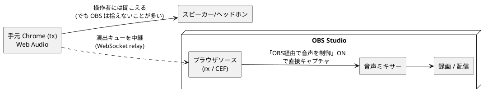

# 演出音を OBS に確実に乗せる（rx + OBS経由で音声を制御）

サウンドボード（演出音・「こんにちは」など）を **OBS の録画／配信に確実に乗せる**ための設定メモ。

> 結論: **配信(rx)の音をON** にして、OBS 側で **ブラウザソースの「OBS経由で音声を制御」を有効** にする。
> これでデスクトップ音声のデバイス設定に一切依存せず、録画にも配信にも演出音が乗る。

関連: [04-OBSでライブ配信.md](04-OBSでライブ配信.md) / [11-カメラ版のエフェクト.md](11-カメラ版のエフェクト.md) / [21-OBSリレイサーバの使い方.md](21-OBSリレイサーバの使い方.md)

## なぜデスクトップ音声では録れないことがあるのか

演出音の出どころは2系統ある。

- **手元(tx)** … 操作者が開いている**通常の Chrome** の Web Audio。スピーカー/ヘッドホンから鳴る → 操作者には聞こえる。
- **配信(rx)** … OBS の**ブラウザソース（OBS内蔵CEF）**が鳴らす音。

OBS の録画に入るのは「OBS のソースの音」と「デスクトップ音声」だけ。
**別アプリ（操作者の Chrome）の Web Audio をデスクトップ音声で拾うのは不安定**で、
出力デバイスやモニタリング設定が少しでも食い違うと、スライダーを最大にしても録音に入らない
（YouTube 再生音すら録れないなら、それは OBS のデスクトップ音声側の設定問題）。

→ なので「操作者の Chrome 音をデスクトップ音声で拾う」のではなく、
**rx（ブラウザソース）で鳴らして OBS が直接そのソースを録る**のが確実。

## 設定手順（推奨）

1. **tx ページで配信(rx)トグルを🔊ON にする**
   - `index.html` 下部のチップ、または Tweaks「演出（サウンドボード）」→「配信(rx/OBS)の音を出す」。
   - 既定で ON（`sbMutedRx` の既定が `false`）。一度設定すれば localStorage に保持される。
2. **OBS でブラウザソースを右クリック → プロパティ**
   - **「OBS経由で音声を制御」(Control audio via OBS)** にチェックを入れる。
3. **OBS の音声ミキサーに該当ブラウザソースが項目として現れることを確認**
   - 演出ボタンを押してメーターが振れれば OK。これで録画/配信に乗る。

これでデスクトップ音声のデバイス設定に依存せず、演出音がキャプチャされる。
手元(tx)は🔇のままでも構わない（自分のモニター用に🔊ON でも可）。

## 手元(tx) / 配信(rx) の2トグルのしくみ

演出音のミュートは **手元と配信を別々に**切り替えられる。

| トグル | 内部キー | 効くページ | 同期 | 用途 |
| --- | --- | --- | --- | --- |
| 手元(tx) | `sbMutedTx` | tx（操作者の Chrome） | **非同期**（tx ローカル） | 操作者のモニター音だけ黙らせる |
| 配信(rx/OBS) | `sbMutedRx` | rx（OBS ブラウザソース） | **同期**（tx→rx へ送る） | rx に UI が無いので tx から遠隔操作 |

- rx 側に設定 UI は無いため、**rx の鳴る/鳴らないは tx の `sbMutedRx` が同期して決まる**。
  tx が「配信ON」なら OBS のブラウザソースが鳴る。
- 音量 `sbGain` は各ページのローカル値（rx 全体の音量は OBS ミキサーで調整する想定）。
- 既定値（`src/camera-app.jsx` の `TWEAK_DEFAULTS`）:
  - `sbMutedTx: false`（手元ON）
  - `sbMutedRx: false`（配信ON）
  - `sbGain: 1` / `sbButtons: true`

実装の同期境界は `LOCAL_ONLY_TWEAKS = ['sbMutedTx', 'sbGain', 'sbButtons']`。
ここに入るキーは `syncableTweaks()` で除外され rx に送られない。
`sbMutedRx` は**わざと除外しない**ので tx から rx へ同期する。

## デスクトップ音声で録りたい場合（次善策）

ブラウザソースを使わず手元 Chrome の音を録るなら、OBS 側を点検する。
「ミキサーのデスクトップ音声メーターが振れるか」で原因が分かれる。

- **メーターが動かない** … 入力段で拾えていない。
  - 設定 → 音声 → グローバル音声デバイス → デスクトップ音声 が「無効」や別デバイスになっていないか（「既定」推奨）。
  - Windows の再生デバイスと OBS のデスクトップ音声デバイスの一致（ヘッドホン/スピーカーの食い違いが多い）。
  - ミキサーでミュート（スピーカーアイコンが赤）になっていないか。
- **メーターは動くのに録音は無音** … 録画トラックの設定。
  - 設定 → 出力 → 出力モード「詳細」のとき、録画タブの「音声トラック」にデスクトップ音声のトラックが含まれているか。
  - ミキサーの歯車 → オーディオの詳細プロパティ → 音声モニタリングが「モニターのみ（出力オフ）」になっていないか。

ただし操作者の Chrome 音を拾う構成は環境依存で不安定なので、**基本は rx + OBS経由で音声を制御を推奨**。

## 関連ファイル

- `src/cue-audio.js` … サウンドボード（Web Audio）。`createSoundboard()` / `setMasterGain()` / iOS 用 `unlock()`。
- `src/cue-system.js` … キュー定義（id/label/sound/tone/gain/stamp/anim/gesture/place）。
- `src/camera-app.jsx` … 2トグル UI・`syncableTweaks()`・マスターゲイン制御。
- `src/face/relay-client.js` / `src/face/use-relay.js` … `sendCue(id)` で演出キューを tx→rx へ中継。
