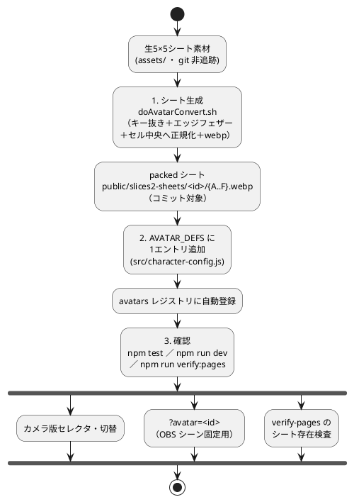

# アバターの追加（カメラ版）

index.html（旧 camera2.html）に新しいアバターを追加する手順メモ。**登録は JSON ではなく
`src/character-config.js`（JS のレジストリ `AVATAR_DEFS`）を編集する。**
`public/default-themes/*.json` は Tweaks のテーマで、アバターとは無関係。

関連: [30-カメラ版のエフェクト.md](30-カメラ版のエフェクト.md) / [10-OBSでライブ配信.md](10-OBSでライブ配信.md)

対象はカメラ版（index.html）のみ。app / talk は単一アバターのまま。

## 規約（先に押さえる）

- **ID は「連番-英小文字」**（例 `01-tomari` / `02-kesyou_jirai_make`）。
  `character-config.test.js` が `^\d{2}-[a-z0-9_-]+$` を強制する。
  素材フォルダ名・公開ディレクトリ名・registry の `id` は**必ず同綴りに揃える**。
- **シート配置は `public/slices2-sheets/<id>/{A..F}.webp`**（アバター別サブフォルダ）。
- **生シート素材は git 非追跡**（`assets/` は ignore）。コミットするのは packed シートのみ。
- **キャラ画像は原則 非商用**（権利元のライセンスに従う。`commercial: false`）。

## 手順

全体の流れ（素材 → シート → レジストリ → 各機能で利用）。



### 1. シートを生成 → `public/slices2-sheets/<id>/`

素材の種類で2通り。

#### グレー背景の生5×5シート（A〜F、不透明）の場合 — `doAvatarConvert.sh`

入力は **png / webp の両対応**（大文字拡張子も可。同名で複数あれば png 優先）。フラットな
グレー背景・不透明な1枚絵5×5シートが前提。外周グレーのキー抜き＋エッジ ~1.5px フェザー＋
**各図柄を均一セル中央へ再配置（正規化）**＋webp 保存まで自動で行う。生シートの格子は 1/5
等分とズレるため、正規化しないと「上を向くと別の顔の下部が写る」ブリードが出る。

```bash
./doAvatarConvert.sh <source-dir> <avatar-id> [grid] [quality] [bg] [fill]
```

引数（位置引数。後ろだけ指定したいときは前の引数も明示する）:

| 引数 | 既定 | 意味 |
| --- | --- | --- |
| `source-dir` | 必須 | `A`〜`F` の生シート（`.png` / `.webp`、`A_*.png` 等の接尾辞可）が入ったフォルダ |
| `avatar-id` | 必須 | 出力先 `public/slices2-sheets/<id>/` の ID（registry の `id` と同綴り） |
| `grid` | `auto` | 出力1辺px（5の倍数）。1セル = `grid/5`。`auto` は元幅を5で割り切れる値へ floor |
| `quality` | `92` | webp 品質 1〜100（`method=6` 固定）。92≒無劣化 / 95〜100 高画質 / 80 軽量 |
| `bg` | `auto` | キー抜きするフラット背景色 `"R,G,B"`。`auto` は四隅24×24の中央値 |
| `fill` | `0.95` | 顔の高さがセルに占める割合 0〜1（画面上の顔サイズ。`grid` とは独立） |

例:

```bash
# 最小（grid/quality/bg/fill すべて auto・既定）
./doAvatarConvert.sh assets/03-foo 03-foo

# webp 入力を grid 2000・q100 で変換（07-wanko の実績コマンド）
./doAvatarConvert.sh assets/07-wanko 07-wanko 2000 100

# 背景の自動推定が外れるとき手動指定、顔を大きめに
./doAvatarConvert.sh assets/03-foo 03-foo auto 92 "147,146,146" 0.98
```

詳細ヘルプは `./doAvatarConvert.sh -h`。

> Real-ESRGAN-GUI（`realesrgan-x4plus-anime` で4倍に拡大 → **WebP 保存**）で精細化した素材を
> そのまま入力にできる（07-wanko はこの流れ）。拡大してもボケるだけなので `grid` は素材解像度を
> 超えない範囲にする。

#### 既にアルファ付き・正規化済みのスライスがある場合

```bash
python tools/pack_sheet.py --avatar <id>
```

### 2. AVATAR_DEFS に1エントリ追加

[src/character-config.js](../src/character-config.js) の `AVATAR_DEFS` に足す。
sheet 方式のみのアバターは次の形（`02` / `03` が雛形。`basePath` / `src` は未使用）。

```js
{
  id: '03-yourname',          // 連番-英小文字（公開ディレクトリ名と一致）
  displayName: '表示名',       // セレクタ表示
  ext: 'webp',
  rows: 5, cols: 5,
  sheets: DEFAULT_SHEETS,     // A〜F の標準割り当て
  commercial: false,          // 商用配信の可否
  credit: 'クレジット文',      // Tweaks「クレジット」行に表示
  attribution: {              // フッターの帰属表示
    prefix: 'キャラクター: ', name: '作者名',
    url: 'https://example.com/', suffix: ' 素材 ／ 非商用',
  },
},
```

これで `avatars` レジストリに自動で載り、カメラ版のセレクタ・`?avatar=<id>`（OBS シーン固定用）・
verify-pages のシート検査に反映される。

### 3. 確認

```bash
npm test              # id 規約・レジストリのテスト
npm run dev           # index.html でセレクタ表示と切替を確認
npm run verify:pages  # build 後、アバター別シートの存在を検査
```

## 編集「しない」もの

- アバター一覧の JSON … 存在しない（レジストリは JS の `AVATAR_DEFS`）。

## 補足

- 新規にキャラ絵を ChatGPT 等で生成するときは、整列テンプレ
  [docs-camera/templates/](templates/)（`head-grid-1125.png` / `head-grid-2048.png` ＝
  25ヘッドを均一グリッド中央へ配置したもの）を参照に使うと格子ズレが減る。
  最終的なセル整列は `doAvatarConvert.sh` の正規化が担保する。
- 切替は `<SpriteAvatar key={avatarId}>` で再マウント（Pixi を作り直す）。
- ライセンス判断は per-avatar。AI 生成でも元素材の権利は消えないので、商用配信したいなら
  権利がクリアな素材だけを使うこと。
