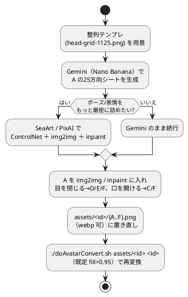

# アバター画像の生成AI（無料）の選択肢

カメラ版のアバター素材（同一キャラの 5×5＝25方向シート＋表情 A〜F）を作るための
画像生成AIメモ。ChatGPT-Image（無料版）の枚数制限で詰まったときの代替先。

関連: [31-アバターの追加.md](31-アバターの追加.md) / [templates/](templates/)

## 用途の要件（選定基準）

- **キャラ一貫性**: 同じキャラを向き違いで崩さず描けること（最重要）。
- **アニメ／イラスト系の画質**。
- **参照画像対応**（img2img / ControlNet / 編集）。整列テンプレ
  [templates/head-grid-1125.png](templates/head-grid-1125.png) などを参照に渡せる。
- **無料枠**（1日あたりの枚数・クレジット制限が中心）。

## おすすめ2択

### 1. ChatGPT-Image に近い使い心地 → Google Gemini（"Nano Banana"）

- 会話ベースで参照画像を渡して編集・一貫生成できる方式が ChatGPT-Image とほぼ同じ。
  キャラ一貫性が強く、無料枠あり（Gemini アプリ / AI Studio）。
- 整列テンプレを渡して「このキャラで25方向」「目を閉じた版」「口を開けた版」と
  指示する流れが作りやすい＝**B〜F の表情差分も作りやすい**。

### 2. キャラシート向けに制御したい → PixAI / SeaArt（アニメ特化・無料デイリー枠）

- **ControlNet（ポーズ/角度指定）＋ img2img ＋ inpaint** が使えるので、テンプレを
  ポーズ参照にして25方向を狙い撃ち、A 面から目閉じ/口開けをインペイントして
  B〜F 差分にできる。
- 無料枠の目安: SeaArt 約150クレジット/日、PixAI デイリー無料クレジット＋
  Reference Pro（多枚一貫編集）。

## その他の無料候補

| ツール | 無料枠の目安 | 強み |
| --- | --- | --- |
| Tensor.Art | 約50クレジット/日 | Pony/Illustrious/Flux 等モデル激多・ControlNet |
| Leonardo.ai | 約150トークン/日（15〜30枚） | キャラ参照機能・扱いやすい |
| Ideogram | 無料枠あり | 参照1枚からの一貫性・文字も得意 |
| Flux.2 | 各ホスト経由で無料 | 線画シャープ・高品質（SeaArt/Tensor 内でも使える） |
| Bing / Microsoft Designer（DALL·E） | 無料クレジット | 手軽。ただし一貫性は弱め |

数値はいずれも調査時点（2026-06）の目安。各ツールで変わるので利用前に確認する。

## B〜F の表情差分を作るコツ

ChatGPT-Image の枚数制限で表情差分（目閉じ D/E/F・口開け C/F）が作れなかった経緯がある。
**img2img / inpaint が使えるツール（上記2系）が特に有効。**

1. まず A（目開け・口とじ）の25方向シートを生成。
2. その A を img2img / inpaint に入れ、目だけ閉じる→D/E/F、口だけ開ける→C/F のように
   局所改変すれば、キャラを保ったまま表情差分が作れる。
3. 生成物を `assets/<id>/{A..F}.png`（webp 可）に置き直し →
   `./doAvatarConvert.sh assets/<id> <id>`（既定 fill=0.95）で再変換。入力は png / webp 両対応。

## 注意

- 無料枠は1日あたりの枚数/クレジット制限が中心。出力解像度や商用可否は各ツールで異なる。
- **商用可否はツールごとに規約確認**。ただし 02/03 は元がいらすとや派生で非商用前提
  （[31-アバターの追加.md](31-アバターの追加.md) のクレジット方針）なので、いずれにせよ
  商用利用は避ける。

## 進め方の目安

まず Gemini（Nano Banana）で 1 の流れを試し、ポーズや表情をもっと厳密に詰めたく
なったら SeaArt / PixAI の ControlNet ＋ inpaint に進む。

## 参考リンク

- [Best AI Anime Generators for Consistent Characters (2026) — Neolemon](https://www.neolemon.com/blog/best-ai-image-generator-for-anime/)
- [8 Best AI Anime Generators 2026 — ZSky AI](https://zsky.ai/blog/best-ai-for-anime-2026)
- [Best AI Anime Generators in 2026 (Free & No Login) — Fiddl.art](https://fiddl.art/blog/en/best-ai-anime-art-tools)
- [10 Best SeaArt Alternatives 2026 — Flowith](https://flowith.io/blog/10-best-seaart-alternatives-anime-stylized-ai-art-2026/)
- [Tensor.Art（無料画像生成）](https://tensor.art/)
- [SeaArt AI Anime Generator](https://www.seaart.ai/features/ai-anime-generator)
- [Ideogram — Character consistency](https://ideogram.ai/features/character/)
