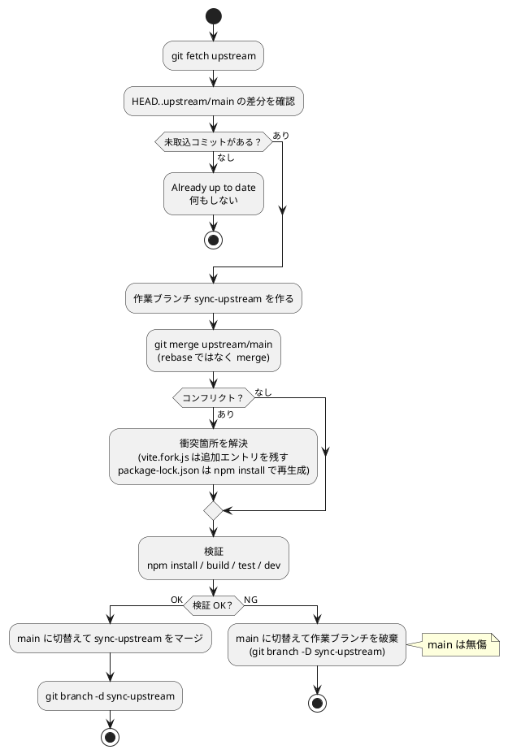

# フォーク元（upstream）の取り込み

本家 [rotejin/tomari-guruguru](https://github.com/rotejin/tomari-guruguru) を pull/マージする
ときの注意とコンフリクト対処メモ。

- このフォークは本家に **カメラ版・トラッキング版** を追加したもの。
- `origin` = 自分のフォーク、`upstream` = 本家。

```bash
git remote -v
# origin    https://github.com/tommie-jp/guruguru-avatar.git
# upstream  https://github.com/rotejin/tomari-guruguru.git
```

## まず現状を確認する

pull の前に、本家に未取込のコミットがあるかを必ず見る。

```bash
git fetch upstream
git rev-list --count HEAD..upstream/main   # 本家側の未取込コミット数（0なら何も来ない）
git log --oneline HEAD..upstream/main      # 何が来るか中身を確認
```

> 未取込が 0 件なら `git pull upstream main` は「Already up to date」で無風。
> 問題が起きるのは本家がコミットを足したときだけ。

## コンフリクトする箇所（地図）

本家と **同じファイルを書き換えている** 箇所だけが衝突候補。
新規追加ファイル（`index.html`（カメラ版・トップ） / `tracking.html` / `src/face/*` /
`src/tracking/(recognizers.js, use-hand-pose.js)` と `src/tracking-app.jsx` /
`src/camera-app.jsx` / `scripts/copy-mediapipe-assets.mjs` / `docs-camera/` など）は、
本家が同名で作らない限り衝突しない。

| ファイル | リスク | 注意点 |
| --- | --- | --- |
| `vite.config.js` / `vite.fork.js` | **最高** | フォーク追加エントリは `vite.fork.js` 側。上書きでカメラ版が消える |
| `package-lock.json` | 高（だが楽） | ほぼ必ず衝突。手で直さず `npm install` で再生成 |
| `package.json` | 高 | `@mediapipe/tasks-vision` 依存・scripts を追加済み。本家の依存更新とぶつかる |
| `src/tweaks-panel.jsx` | 中〜高 | 大きく追記済み |
| `src/app.jsx` / `src/talk-app.jsx` | 中 | 小さい改変。衝突しても局所的 |
| `.gitignore` / `scripts/verify-pages-build.mjs` | 低 | 追記・1行程度。衝突しても自明 |

### 触らなくてよいもの

- `public/mediapipe/` … `.gitignore` 対象。`copy-mediapipe-assets.mjs` が
  都度生成するので pull で壊れない。
- `docs/`（ワーキングツリー上のパス） … 本家所有。**リネームしない**こと（リネームすると pull のたび復活して重複する）。
  自分のドキュメントは本フォルダ `docs-camera/` に置く。

## 取り込み手順

`main` で直接やらず、作業ブランチで解決・検証してからマージする。



```bash
cd guruguru-avatar
git fetch upstream
git log --oneline HEAD..upstream/main      # 来る内容を確認
git switch -c sync-upstream                # 一時ブランチ
git merge upstream/main                     # ここでコンフリクト解決（rebase ではなく merge）
```

- `rebase` ではなく **`merge`** 推奨（自作コミットを巻き戻さずに済む）。
- `package-lock.json` が衝突したら、ロックは手編集せず:

```bash
git checkout upstream/main -- package.json  # 必要なら本家版を土台に
# package.json を正しい形に手でマージしてから
npm install                                  # lock を再生成
git add package.json package-lock.json
```

### `vite.fork.js` を直すときの最重要ポイント

ビルド設定は **2ファイル構成** になっている。

- `vite.config.js`（upstream）… `main` / `guruguru` / `talk` の3エントリのみ。本家のまま触らない。
- `vite.fork.js`（フォーク追加）… `tracking` / `index_old` / `camera2` の3エントリだけを持ち、`mergeConfig` で upstream の `input` に**マージ追加**される（上書きではない）。

`vite.fork.js` の `build.rollupOptions.input` に **自分の追加エントリを必ず残す**。

```js
// vite.fork.js の build.rollupOptions.input — フォーク追加分だけを書く。
// main/guruguru/talk は vite.config.js 側にあり、mergeConfig で合成される。
// 新しいページを足すときはここに1行足すだけ（vite.config.js は触らない）。
input: {
  index_old: resolve(import.meta.dirname, 'index_old.html'),// 互換リダイレクト → index.html（消さない）
  camera2:   resolve(import.meta.dirname, 'camera2.html'),  // 互換リダイレクト → index.html（消さない）
  tracking:  resolve(import.meta.dirname, 'tracking.html'), // カメラ/手トラッキング版（消さない）
},
```

> `camera2.html` と `index_old.html` は現在 `index.html`（カメラ版）へのリダイレクト専用。
> 旧 URL の共有リンクや OGP への互換のために残している。

server の `VITE_HOST` / `VITE_NO_OPEN` 対応も自分の追加分（[01-使い方.md](01-使い方.md) 参照）。

## マージ後の検証（必須）

ビルド・テストが通ることを確認してから `main` にマージする。

```bash
npm install
npm run build      # index.html / tracking.html が dist/ に出るか
npm test           # 顔向き推定などのユニットテスト
npm run dev        # 実際にカメラ版が動くか目視
```

問題なければ:

```bash
git switch main
git merge sync-upstream
git branch -d sync-upstream
```

壊れていたら作業ブランチを捨てればよい（`main` は無傷）。

```bash
git switch main
git branch -D sync-upstream
```
