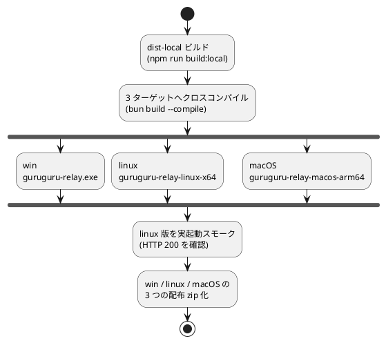

# 単体バイナリにする（Node も Bun も不要で配る）

配布先に Node.js も Bun も入れたくないとき、中継 + 静的配信を 1 つのバイナリに固めて、
`dist-local\`（配信物）と起動スクリプトを添えて配る。仕組みは **Bun の単一実行バイナリ**
（`bun build --compile`）。ランタイム（Bun）がバイナリに同梱されるため、配布先には何も
インストール不要で動く。`dist-local`（index.html / assets / mediapipe）はバイナリの隣に置いて
`--web-root` で配る。

旧来の Node SEA（Single Executable Applications）＋ postject による方式は廃止した。Bun では
`bun build --compile` の 1 コマンドで完結し、しかも **1 台の Linux/WSL から Windows / Linux /
macOS の 3 ターゲットをクロスコンパイルできる**（旧 SEA のように Windows 上で作る必要はない）。

通常の運用（Node を入れて使う）は [14-Windowsで動かす.md](14-Windowsで動かす.md) を参照。
バイナリ化は「ランタイムを入れない配布」をしたいときだけでよい。

## 前提

- **1 台からクロスコンパイルできる**。Windows 上で作る必要はない（WSL/Linux 1 台で
  win / linux / macOS の 3 つを生成できる）。
- ビルドには **Bun** が要る（`bun --version` で確認）。無い場合は
  `curl -fsSL https://bun.sh/install | bash`（Windows は後述の `build-exe.ps1` が自動取得）。
- `dist-local` のビルドに **Node** を使う（開発機側の前提。配布先には不要）。

## かんたんビルド

経路は 2 つ。WSL/Linux が使えるなら `doBuild.sh` が手軽。

### 1) doBuild.sh（3 ターゲット一括・クロスコンパイル）

`guruguru-avatar\` フォルダで:

```bash
./doBuild.sh
```

これで「dist-local ビルド → 3 ターゲットへクロスコンパイル → linux 版を実起動スモーク →
win / linux / macOS の 3 つの配布 zip 化」までを 1 台で行う。bun は PATH か `~/.bun/bin` から
解決する（`BUN=/path/to/bun ./doBuild.sh` で上書き可）。



出力は `dist-exe\` に揃う:

- `guruguru-relay.exe` … Windows 版（中継 + 静的配信・ランタイム同梱・単体動作）
- `guruguru-relay-linux-x64` … Linux 版
- `guruguru-relay-macos-arm64` … macOS (Apple Silicon) 版
- `dist-local\` … 配信物（index.html ほか）
- `start.bat` / `start.sh` / `start.command` … 各 OS の起動用
- `README.txt` … 配布先向けの説明
- `guruguru-avatar-{win,linux,macos}-v<version>.zip` … 各 OS の配布 zip

配布先には、対応する zip を渡して「すべて展開」してもらい、起動スクリプトを実行するだけ。

### 2) windows/build-exe.ps1（Windows 単体）

WSL が無く Windows 上だけで作りたい場合。`guruguru-avatar\` フォルダで PowerShell:

```powershell
powershell -ExecutionPolicy Bypass -File windows\build-exe.ps1
```

bun が無ければ bun.sh から自動インストールし、`bun build --compile --target=bun-windows-x64`
で Windows 版 exe を作る。出力は `dist-exe\guruguru-relay.exe` / `dist-exe\dist-local\` /
`dist-exe\start.bat`。`dist-exe\` を丸ごと配布すれば、配布先では **`start.bat` をダブルクリック**
するだけで動く（Node も Bun も不要）。

## 中身（手動でやる場合）

ビルドの本体は `bun build --compile` の 1 行。3 ターゲットそれぞれ次の通り:

```bash
# 1. 静的配信物（dist-local）を先に作っておく
npm run build:local

# 2. リレイサーバを単一バイナリにコンパイル（ターゲットごとに 1 行）
bun build --compile --minify --target=bun-windows-x64 server/relay.mjs --outfile dist-exe/guruguru-relay.exe
bun build --compile --minify --target=bun-linux-x64    server/relay.mjs --outfile dist-exe/guruguru-relay-linux-x64
bun build --compile --minify --target=bun-darwin-arm64 server/relay.mjs --outfile dist-exe/guruguru-relay-macos-arm64
```

npm スクリプトでも同じことができる:

```bash
npm run build:relay         # 3 ターゲット一括
npm run build:relay:win     # bun-windows-x64 のみ
npm run build:relay:linux   # bun-linux-x64 のみ
npm run build:relay:macos   # bun-darwin-arm64 のみ
```

`server/relay.mjs` / `server/static.mjs` は無改造で **Node でも Bun でも動く**。開発時に
ソースから起動するだけなら `npm run relay`（= `node server/relay.mjs`）がそのまま使える。

## 起動と接続

起動コマンドは従来どおり。Windows なら `start.bat` が内部で次を実行する
（ポートを変えたいときはここを編集）:

```bat
guruguru-relay.exe --web-root dist-local --port 8787 --host 127.0.0.1
```

Linux / macOS は `start.sh` / `start.command` が同様に各バイナリを起動する。

- 送信側(tx): `http://127.0.0.1:8787/?tx`（Edge/Chrome）
- OBS 受信側(rx): `http://127.0.0.1:8787/?rx`（OBS のブラウザソース。rx は既定で透過＋UI 非表示）

LAN の別端末からも繋ぐなら `--host 0.0.0.0`（要ファイアウォール許可）。

## WSL から作る・試す場合

WSL/Linux なら **linux 版バイナリをその場で実起動して検証できる**（`doBuild.sh` の
スモークテストがこれを自動で行い、HTTP 200 を確認する）。Windows 版 exe を WSL の interop
で動かすことも引き続き可能。

## 注意

- **SmartScreen 警告**: コード署名をしていないため、Windows の初回起動で「発行元不明」が
  出ることがある。「詳細情報」→「実行」で起動できる（社内/個人配布なら通常これで十分）。
  macOS 初回は Gatekeeper が出たら右クリック→「開く」で許可する。
- **バイナリのサイズ**: ランタイム（Bun）を同梱するため数十 MB になる。これは単一実行
  バイナリの仕様。
- **更新時**: コードや配信物を変えたら `doBuild.sh`（または `build-exe.ps1`）を再実行して
  `dist-exe\` を作り直す。
