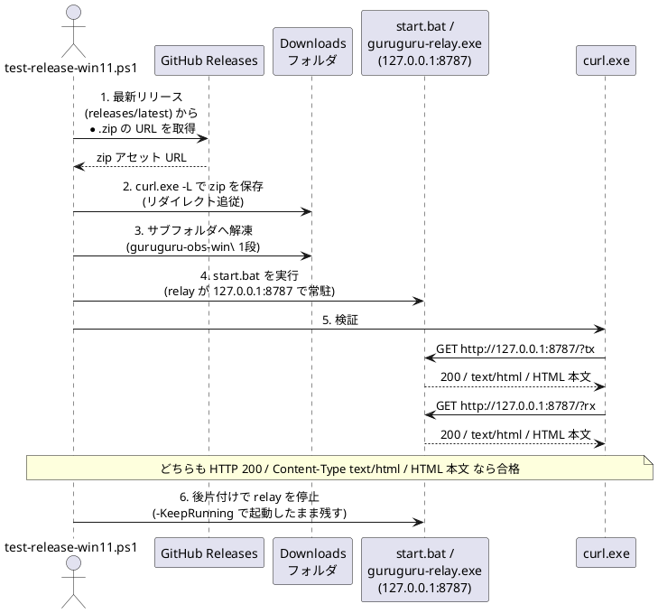

# リリースの動作テスト（Windows 11 で zip を実機検証）

GitHub Releases に上げた **Windows 用 zip** を、配布先のユーザーと同じ手順で
実機（Windows 11）に展開し、`start.bat` で起動して **`?tx` / `?rx` が curl で
取得できるか**まで自動で確かめるスクリプト。配布前のスモークテスト用。

EXE のビルド自体は [53-単体EXEにする.md](53-単体EXEにする.md)、通常運用は
[14-Windowsで動かす.md](14-Windowsで動かす.md)、テスト全体の方針は
[54-テスト.md](54-テスト.md) を参照。ここは「公開済みリリースを落として動くか」だけを見る。

## 何をするスクリプトか

`windows\test-release-win11.ps1` が次を順に実行する（ユーザー手順そのまま）:

1. GitHub の **最新リリース**（`releases/latest`）から `*.zip` アセットの URL を取得
2. **ダウンロードフォルダ**へ zip を保存（`curl.exe -L` でリダイレクト追従）
3. ダウンロードフォルダ内のサブフォルダに **解凍**（zip は `guruguru-obs-win\` 1段でくるまれている）
4. 同梱の **`start.bat` を実行**（`guruguru-relay.exe` が `127.0.0.1:8787` で常駐）
5. **curl で検証**:
   - 送信側 `http://127.0.0.1:8787/?tx`
   - OBS 受信側 `http://127.0.0.1:8787/?rx`

   どちらも **HTTP 200 / `Content-Type: text/html` / HTML 本文**なら合格。
6. 後片付けで relay を停止（`-KeepRunning` を付けると起動したまま残す）

> **メモ**: 静的配信ハンドラはクエリを捨てて `/` を `index.html` に寄せるため、
> `?tx` と `?rx` は **同じ HTML（200）** を返す。クエリの違いはブラウザ側の JS と
> WebSocket の `role` で効くだけで、HTTP 応答としては同一。curl で見られるのは
> 「サーバが起動して配信できているか」まで（tx→rx の WS 中継までは見ない）。



## 使い方

配布 zip を試したい Windows 11 上で。`guruguru-avatar\windows\` を開いて:

### かんたん（ダブルクリック）

`test-release-win11.bat` をダブルクリックするだけ。中で PowerShell を
`-ExecutionPolicy Bypass` で呼ぶので、実行ポリシーを触らなくてよい。

### PowerShell から

```powershell
powershell -NoProfile -ExecutionPolicy Bypass -File windows\test-release-win11.ps1
```

オプション:

| オプション | 既定 | 説明 |
| --- | --- | --- |
| `-Repo <owner/repo>` | `tommie-jp/guruguru-avatar` | 対象リポジトリ |
| `-TimeoutSec <秒>` | `60` | サーバ起動を待つ最大秒数（初回は EXE の検疫で延びる） |
| `-KeepRunning` | off | 検証後も relay を止めず残す（画面確認したいとき） |
| `-SkipDownload` | off | ダウンロード済み zip を再利用し、解凍からやり直す |

```powershell
# 起動したまま残して、ブラウザで tx/rx を目視確認したい
powershell -NoProfile -ExecutionPolicy Bypass -File windows\test-release-win11.ps1 -KeepRunning
```

## 出力と終了コード

最後に検証結果を表で出し、総合判定を返す。

```text
==================== 検証結果 ====================
Label          Code ContentType                Html Pass
-----          ---- -----------                ---- ----
tx (送信側)     200  text/html; charset=utf-8   True True
rx (OBS 受信側) 200  text/html; charset=utf-8   True True

[OK]    総合判定: PASS ✅  (tx / rx ともに 200 OK / HTML)
```

- **終了コード 0** … tx / rx ともに 200 OK / HTML（PASS）
- **終了コード 1** … いずれか失敗、またはサーバが時間内に起動しなかった（FAIL）

CI や別スクリプトから呼ぶときはこの終了コードで合否を判定できる。

## 仕組みの要点

- **curl は実体を使う**: `C:\Windows\System32\curl.exe` を直接呼ぶ。PowerShell の
  `curl` エイリアス（`Invoke-WebRequest`）ではない。`-w '%{http_code}|%{content_type}'`
  でステータスと型を 1 回の呼び出しで取り、本文は一時ファイルに落として HTML 判定する。
- **SmartScreen で止まらないように**: ダウンロードした zip と解凍後のツリーから
  `Unblock-File` で Mark-of-the-Web を外す。これをしないと初回起動で「発行元不明」が出て
  `guruguru-relay.exe` がブロックされ、起動待ちがタイムアウトすることがある
  （[53-単体EXEにする.md](53-単体EXEにする.md) の SmartScreen 注意点と同じ理由）。
- **host/port は `start.bat` から読む**: バッチ内の `--port` / `--host` を正規表現で拾うので、
  配布側でポートを変えても curl 先が追従する。`--host 0.0.0.0` のときは loopback
  （`127.0.0.1`）でアクセスする。
- **後片付け**: relay は名前（`guruguru-relay`）で `Stop-Process` する。`start.bat` が
  `start /min` で別プロセスとして常駐させるため、バッチを起動した cmd ウィンドウを閉じても
  relay は残る。`finally{}` で確実に止める（途中で例外が出ても止める）。

## 注意

- **ダウンロードフォルダ**はレジストリの既知フォルダ（Downloads の GUID）から解決し、
  取れなければ `%USERPROFILE%\Downloads` にフォールバックする。
- **`start.bat` は既定ブラウザで `?tx` を開く**ため、テスト中にブラウザが 1 枚立ち上がる
  （実ユーザー体験どおり・無害）。`-KeepRunning` を付けない限り relay は最後に停止する。
- **API レート制限**: 未認証だと GitHub API は 60 回/時。引っかかるなら環境変数
  `GITHUB_TOKEN` を入れておくと `Authorization` ヘッダを付けて緩和する。
- **WSL からも回せる**: interop で `powershell.exe` 経由なら WSL のシェルからそのまま実行できる
  （下の「WSL2 から実行する」参照）。ただし WSL の Linux `curl` で直接 `127.0.0.1:8787` は
  叩かないこと（NAT モードでは届かない）。

## WSL2 (Ubuntu 24) から実行する

WSL2 は interop で Windows の `.exe` を実行できるので、**WSL のシェルから `powershell.exe`
経由で同じテストを丸ごと回せる**（実証済み）。

```bash
WINPS1="$(wslpath -w "$PWD/windows/test-release-win11.ps1")"
powershell.exe -NoProfile -ExecutionPolicy Bypass -File "$WINPS1" -Tag win-v1.4.0
# -Tag を省くと最新リリース(releases/latest)を対象にする
```

ポイントは **relay も curl.exe も Windows プロセスとして動く**こと。両者は Windows の
ループバック（`127.0.0.1`）で会話するので、WSL のネットワークが NAT モード
（`wslinfo --networking-mode` が `nat`）でも境界をまたがず通る。zip の展開・start.bat の実行・
curl 検証はすべて Windows 側（`C:\Users\<user>\Downloads\...`）で完結する。

### やってはいけないこと

- **WSL の Linux `curl` で `http://127.0.0.1:8787` を叩く**。NAT モードでは WSL の
  ループバックと Windows のループバックは別物なので届かない（mirrored モードなら可）。
  本スクリプトは中で Windows の `curl.exe` を呼ぶのでこの問題を回避している。
- **Bun ビルドの `guruguru-relay.exe` を WSL ファイルシステム上から直接 interop 実行する**。
  9p 越しだと即 `255` 終了して起動しない。必ず Windows ドライブ（Downloads など）から動かす。
  本スクリプトは Downloads に展開してから起動するのでこの条件を満たす。

## doDeploy.sh win との統合

`./doDeploy.sh win`（および `./doDeploy.sh all` の後半）は、リリース zip をアップロードした後に
**GitHub 上でその zip が取得可能になるまで待ってから、このテストを自動実行する**:

1. `gh release upload`（または `create`）で `win-v<version>` を配置
2. API でアセットが `state=uploaded` かつローカルと同サイズになり、実ダウンロード
   （先頭 1 バイトの range GET）が 200/206 を返すまでポーリング（最大 ~3 分）
3. `powershell.exe -File windows\test-release-win11.ps1 -Tag win-v<version>` を実行
4. テストが FAIL（exit≠0）なら `doDeploy.sh` も失敗終了する

スキップしたいとき:

- `DEPLOY_SKIP_WIN_TEST=1 ./doDeploy.sh win` … テストだけ飛ばしてリリースまでで止める
- `powershell.exe` が無い環境（素の Linux CI 等）では自動でスキップし、手動実行コマンドを案内する
